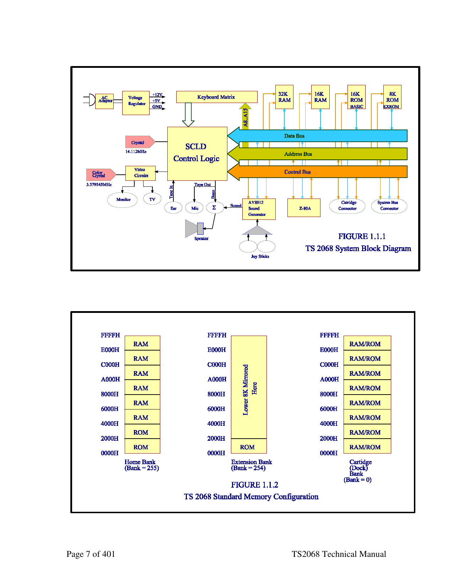
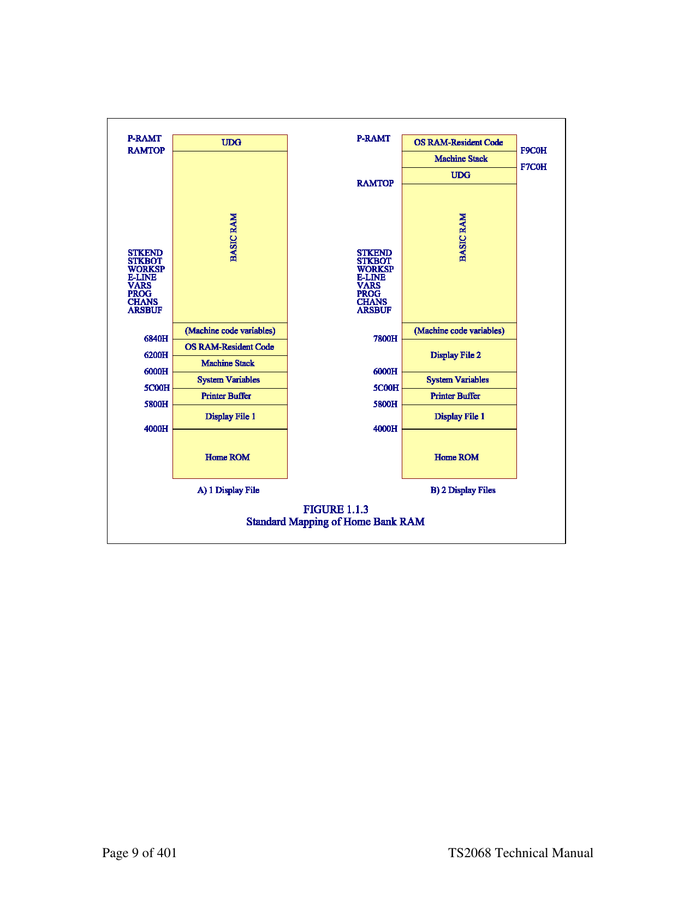
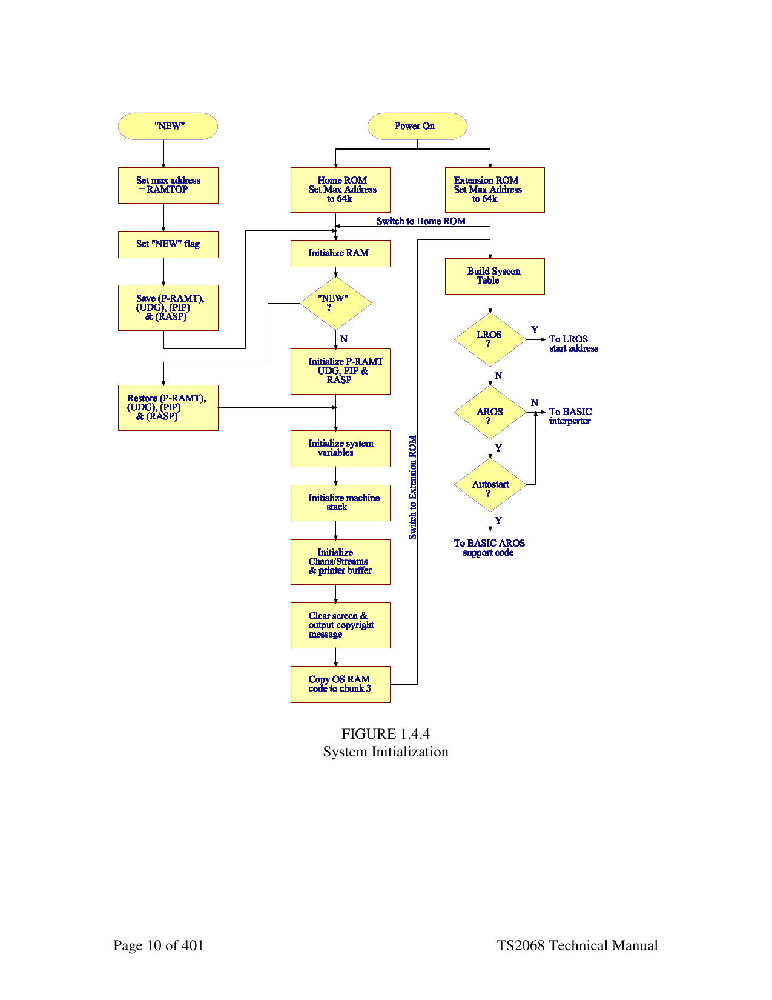

<!--
  DERIVED FILE — do not treat as authoritative.

  Source: docs/Timex Sinclair 2068 Technical Manual (best).pdf, pages 6-11
  Extracted mechanically with `pdftotext -layout`; tables in this chapter were
  then transcribed by hand and checked against the rendered page.

  The PDF itself is a 2016 Microsoft Word reconstruction of the 1986 Second
  Edition, and its own preface warns that the cut-and-paste used to make it
  "would sometimes mix text up in a way that word groups from a particular
  sentence would be transposed to different locations". That corruption is in
  the PDF, not in this extraction — see for example the bullet list on page 6.
  <!-- PDF page N --> markers below give the source page for every passage, so
  anything surprising can be checked against the original.
-->

# 1. Introduction

*Timex Sinclair 2068 Technical Reference Manual — pages 6-11.*
*[Full PDF](../Timex%20Sinclair%202068%20Technical%20Manual%20%28best%29.pdf) · [chapter index](README.md)*

---

<!-- PDF page 6 -->

# 1. Introduction

This manual provides detailed technical information on the Timex Sinclair 2068 Personal
Color Computer. In conjunction with the TS2068 User Manual, it is intended to assist the
reader in understanding the architecture, hardware and software features, programming
techniques and I/O techniques pertaining to the TS2068.

### 1.1 TS2068 Overview

#### 1.1.1 Hardware Overview

Figure 1.1-1 is a block diagram of major functional components connections. These
components are:
- Control Logic - SCLD (Standard Cell
- CPU - Z80A Microprocessor
- the TS2068 showing the
- and their logical
- Logic Device)
- RAM- 48K Random Access Memory
- ROM- 24K System Read-Only Memory (16K plus 8K Extension)
- System Bus Connector
- Cartridge Connector
- Sound Generator/Speaker
- Video Circuits
- Cassette READ/WRITE
- Joystick Connectors

The TS2068 Cartridge Connector provides for the plug-in of cartridges containing
programmed ROM's with up to 64K of addressable memory. The full 64K is not
normally utilized (e.g., due to need for access to RAM for the machine stack). See
Section 5.1 for details. Figure 1.1-2 shows the standard TS2068 memory configuration
comprised of the Home Bank, the ROM Extension Bank and the Dock (Cartridge) Bank.
This memory is selectable as eight 8K 'chunks' with the Home Bank being enabled by
default, i.e., any chunk not selected in the Extension or Dock Bank is automatically
enabled in the Home Bank. Memory selection and I/O are controlled via the I/O ports.
These topics are covered in detail in later sections.

<!-- PDF page 7 -->

*Figures 1.1-1 and 1.1-2 — TS 2068 system block diagram, and the standard memory configuration of the Home, Extension and Dock banks. Rendered from page 7 of the PDF: these drawings are vector art from the original Word document and carry no extractable text.*

<!-- PDF page 8 -->

#### 1.1.2 System Software Overview

The TS2068 System Software resides in the Home ROM, the Extension ROM, and
dedicated RAM. It supports the following functions:
- System Initialization
- BASIC Interpreter (including BASIC cartridge support)
- BASIC I/O for Standard Peripherals
o keyboard
o video screen
o 2040 32-col. dot matrix printer
o cassette tape
o joysticks
o software generated sound (BEEP)
o programmable sound chip (SOUND)
- Video Mode Change Service
- Interruption Servicing (Z80 Int. Mode 1)
- Bank Switching/Data Transfer Services
- Function Dispatcher (provides access to selected system routines via a Service
Code input)

In addition, portions of the Home Bank RAM are used for the machine stack, the BASIC
system variables, the Printer Buffer and the Display Files. Figure 1.1-3 shows the
standard mapping of the Home Bank RAM and the mapping necessary when the second
display file is to be used with the BASIC interpreter still functional. The Video Mode
Change Service routine makes these memory modifications.

Note: There is no direct support of the second display file via BASIC or in the system
ROM I/O routines. Figure 1.1-4 is a Flowchart of the System Initialization
process.

<!-- PDF page 9 -->

*Figure 1.1-3 — RAM layout in normal video mode and with the OS RAM-resident code relocated for extended video. Rendered from page 9 of the PDF: these drawings are vector art from the original Word document and carry no extractable text.*

<!-- PDF page 10 -->

*Figure 1.1-4 — system initialization flowchart. Rendered from page 10 of the PDF: these drawings are vector art from the original Word document and carry no extractable text.*

FIGURE 1.4.4
System Initialization

<!-- PDF page 11 -->

#### 1.1.3 Cartridge Software Overview

The TS2068 supports two basic types of Cartridge or ROM-Oriented Software designated
as LROS (Language ROM-Oriented Software) and AROS (Application ROM-Oriented
Software) which pluq into the cartridge connector. They are identified via overhead bytes
at Location 0 for an LROS or 32768 (8000H) for an AROS. The fundamental difference
is that an LROS contains 280 machine code in memory chunk 0 and is in total control of
the TS2068 hardware including the RESTART implementation and Interruption Mode
setting and handling, while an AROS is dependent on the System ROM or an LROS for
these functions if needed. An AROS written in BASIC, which may also include machine
code accessed via the USR function, is supported from the System ROM BASIC
Interpreter and is mapped beginning in memory chunk 4. An AROS may also be written
entirely in Z80 machine code. An AROS written in any other high-level language would
require an LROS supporting that language and would have to be integrated with the
LROS in a single cartridge. See Sections 3.2.1.2, BASIC AROS Support and 5.1,
Cartridge Software/Hardware, for additional details.
