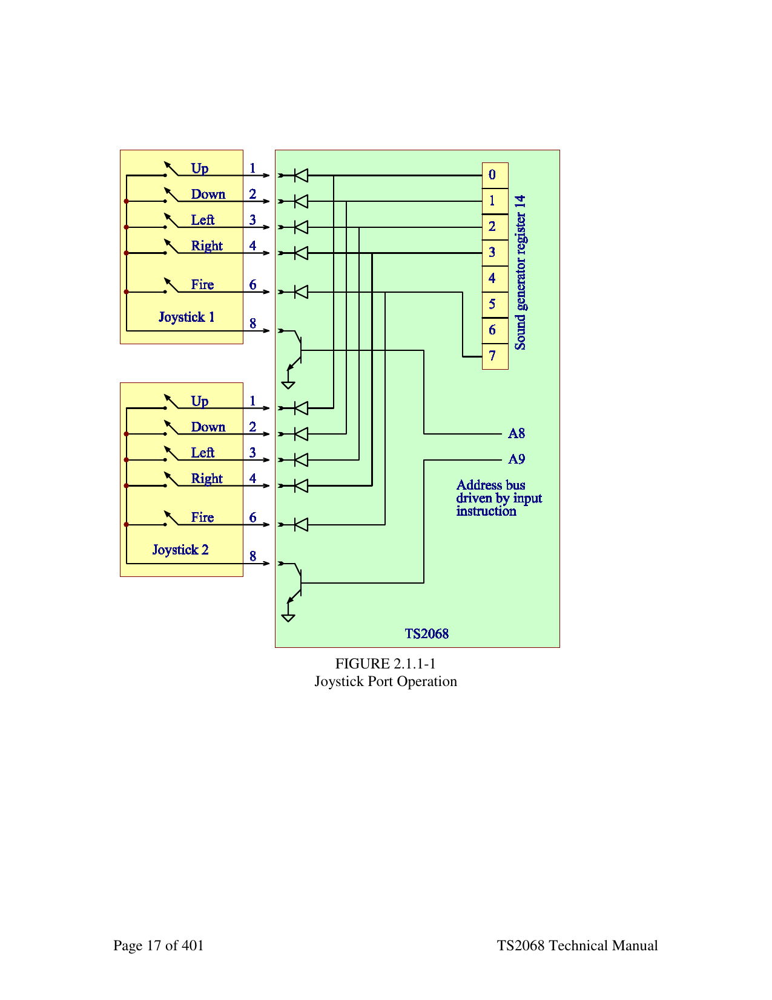
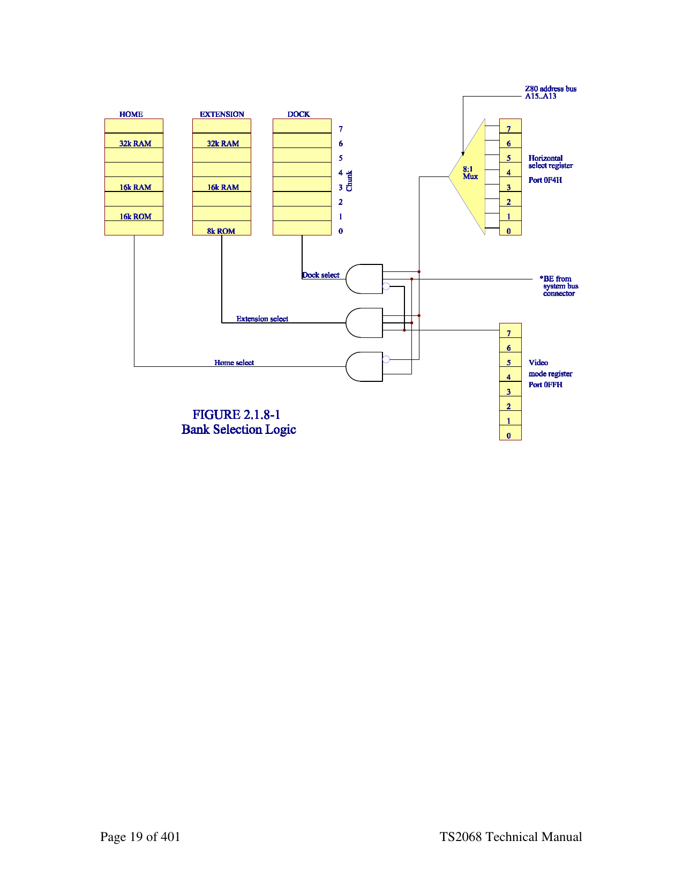
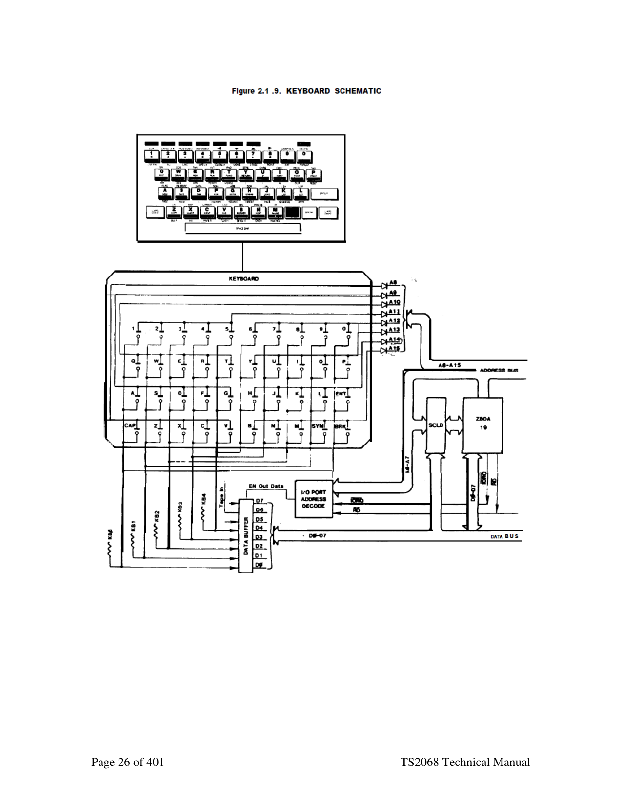
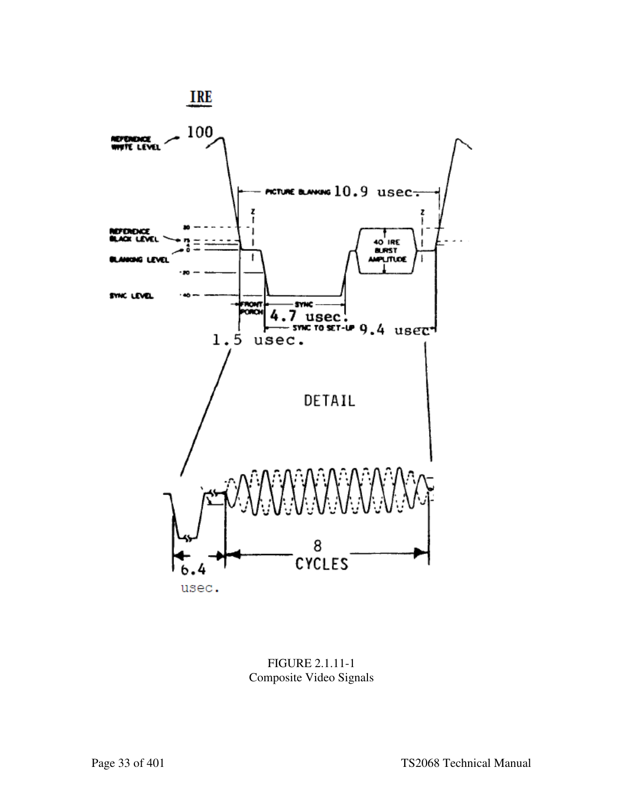
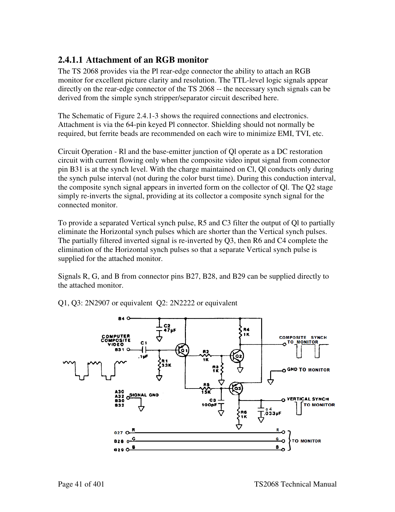
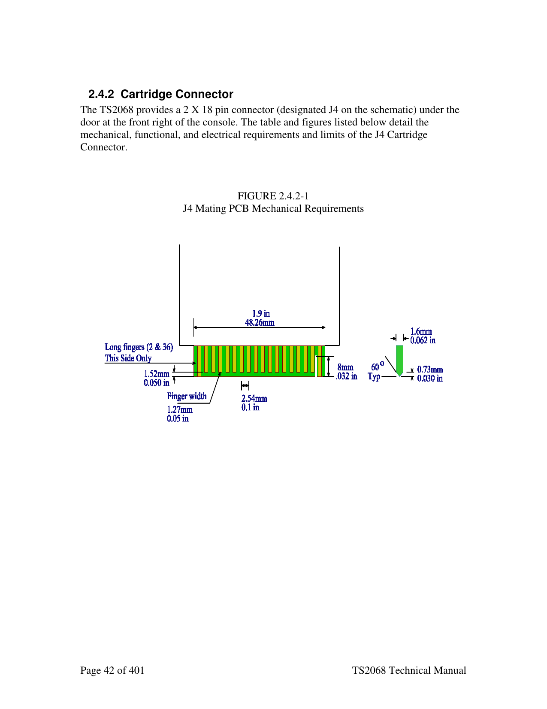
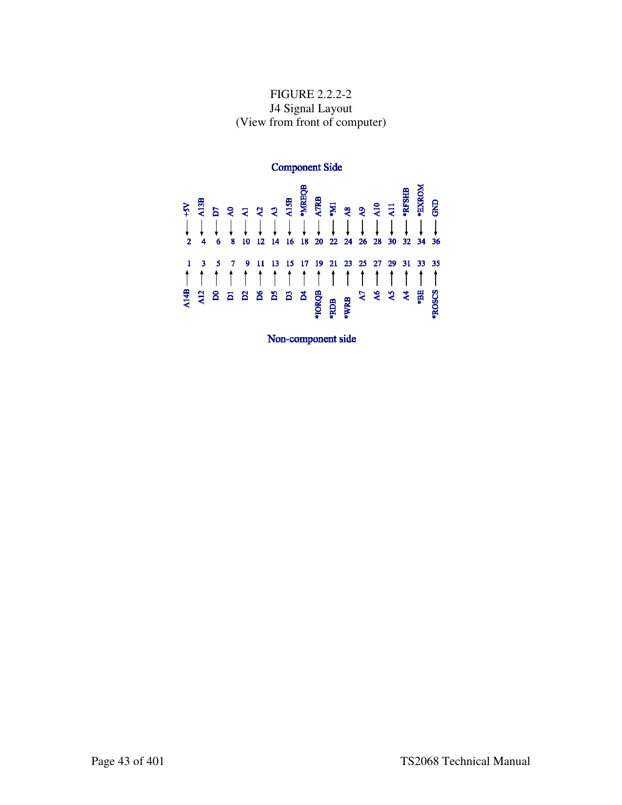
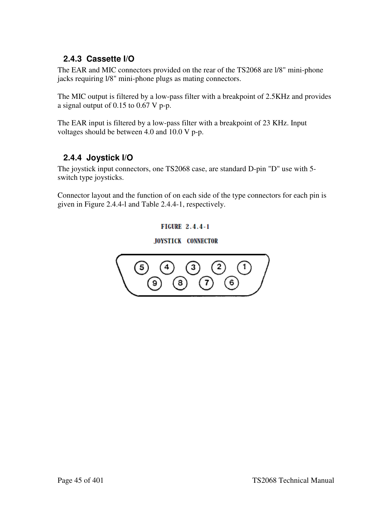
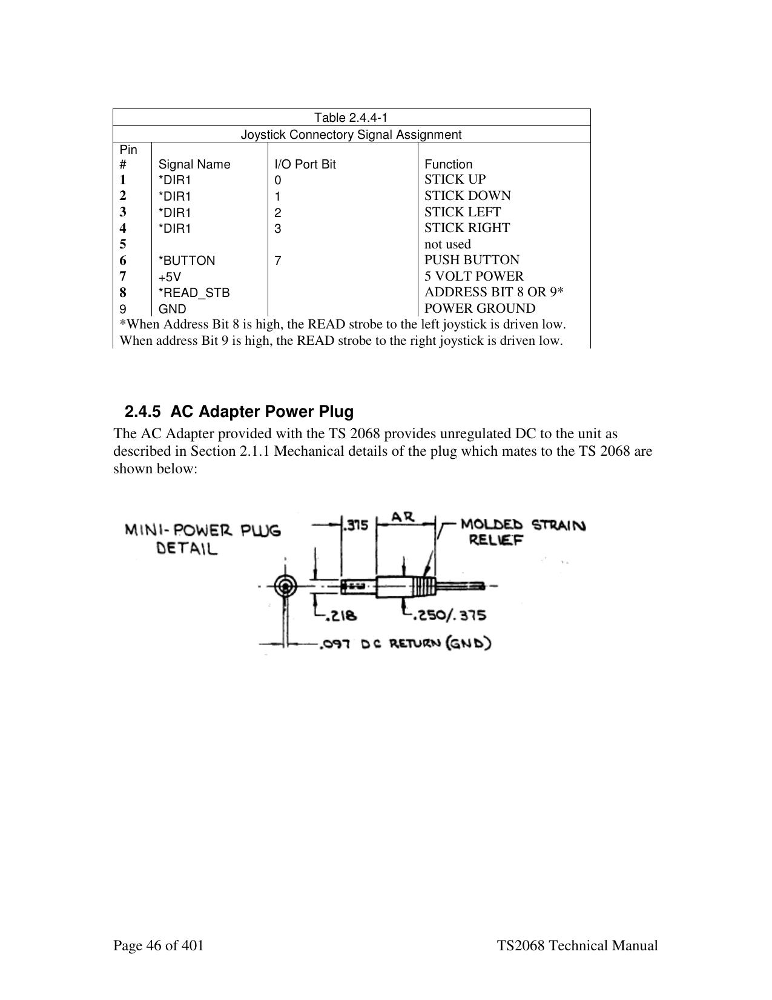
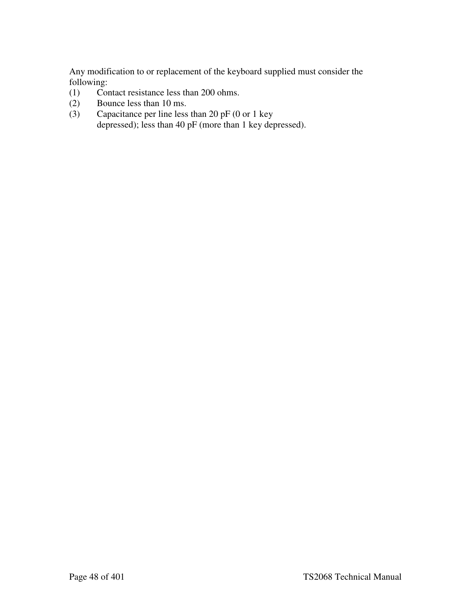

<!--
  DERIVED FILE — do not treat as authoritative.

  Source: docs/Timex Sinclair 2068 Technical Manual (best).pdf, pages 12-48
  Extracted mechanically with `pdftotext -layout`; tables in this chapter were
  then transcribed by hand and checked against the rendered page.

  The PDF itself is a 2016 Microsoft Word reconstruction of the 1986 Second
  Edition, and its own preface warns that the cut-and-paste used to make it
  "would sometimes mix text up in a way that word groups from a particular
  sentence would be transposed to different locations". That corruption is in
  the PDF, not in this extraction — see for example the bullet list on page 6.
  <!-- PDF page N --> markers below give the source page for every passage, so
  anything surprising can be checked against the original.
-->

# 2. Hardware Guide

*Timex Sinclair 2068 Technical Reference Manual — pages 12-48.*
*[Full PDF](../Timex%20Sinclair%202068%20Technical%20Manual%20%28best%29.pdf) · [chapter index](README.md)*

---

<!-- PDF page 12 -->

## 2 Hardware Guide

### 2.1 Description of Major Hardware Functions

Figure 1.1-1 shows a simplified block diagram of the TS2068. The following functional
units are described in the following sections:

Section                      Functional Unit

#### 2.1.1 AC Adapter

```text
2.1.2                        Voltage Regulation
2.1.3                        Z-80A CPU
2.1.3.1                             Address Bus
2.1.3.2                             Data Bus
2.1.3.3                             Control Signals
2.1.3.4                             Opcode Fetch
2.1.3.5                             Memory Read/Write
2.1.3.6                             I/O Read/Write
2.1.3.7                             Masakable interrupt
2.1.3.8                             Non-maskable interrupt (NMI)
2.1.4                        ROM
2.1.5                        32K RAM
2.1.6                        Sound Generator
2.1.7                        Joystick ports
2.1.8                        Control Logic
2.1.8.1                             Bank Selection Logic
2.1.8.2                             Z80 Clock Generator
2.1.8.3                             Display file Access
2.1.8.4                             Interrupt Generation
2.1.9                        Keyboard
2.1.10                       16K Video Display RAM
2.1.11                       Video generation
2.1.11.1                            Composite Video
2.1.11.2                            RF Modulator
2.1.12                       Cassette I/O
2.1.13                       Port Map
```

<!-- PDF page 13 -->

#### 2.1.1 AC Adapter

The AC Adapter transforms 117V AC (Nominal) to filtered DC via a step down
transformer, full-wave bridge rectifier, and filter capacitor to supply from 14 to 25 volts
at 1 amp over the AC voltage variation range of 105 to 130 V AC. Transformer isolation
exceeds 1500 volts.

#### 2.1.2 Voltage Regulation

Unregulated DC from the AC Adapter is supplied for regulation through a bi-filar
torroidal inductor which reduces conducted line emanation for FCC compliance and
through the power-ON/OFF switch located on the left side of the TS2068. This switch
voltage is supplied to the System Bus Connector (see Section 2.4) and for regulation to
the +12 V regulator and the +5 V regulator.

The 12V regulator is a 78L12 series 5V regulator is a switching supply circuit.

Characteristics are as follows:

```text
SUPPLY         VOLTAGE RANGE CURRENT RANGE
5V             4.75 - 5.25V  200ma - 1.0A
12V            11.5 - 12.5V  20ma - l00ma
```

#### 2.1.3 Z-80A CPU

See the attached Z80 data sheet PDF files for detailed information about the CPU.

##### 2.1.3.1 Z-80A Clock

The Z80 clock frequency is 3.528MHz derived in the SCLD by dividing the 14.112MHz
master clock by four.

##### 2.1.3.2 Z-80A Interrupts

###### 2.1.3.2.1 Non-maskable interrupt

The non-maskable interrupt is not used in the TS2068. The input to the Z80 is
available on the system expansion connector.

###### 2.1.3.2.2 Maskable interrupt

The TS2068 sets the Z80 for MODE1 interrupts. This mode causes a subroutine
call to location 0038H in the Z80 address space. If chunk 0 is switched to the
dock bank, the code must either disable interrupts or provide an interrupt handler
at this address.

<!-- PDF page 14 -->

#### 2.1.4 ROM

The system includes both a 16K byte ROM and an 8K byte ROM mapped into the
address space as follows:

U16 is a 16kX8 23128 mask programmed ROM and is mapped into the HOME bank at
locations 0000H..3FFFH.
U20 is a 8kX8 2364 mask programmed ROM and is mapped into the EXTENSION bank
at 0000H..1FFFH.

Section 2.1.8.1 describes the selection of the Home Bank and Expansion Bank via the
control logic. The devices involved are a 23128 and a 2364 for the 16K byte (128K-bit)
and the 8K byte (64K-bit) ROM's respectively. Direct replacement of these devices with
27128 and 2764 EPROM's is not possible since pins 1 and 27 must be maintained in the
high state for those devices.

#### 2.1.5 32k RAM (Address 8000-FFFFH)

The upper 32K of RAM is composed of four 200ns 4416's (16K x 4 dynamic RAMs).

#### 2.1.6 Sound Generator

The Programmable Sound Generator (GI 8912) is accessed via Ports 0F5H (Address) and
0F6H (Data). The basic registers in the PSG which produce the programmed sounds
include:
- Tone Generators: Produce the basic square wave tone frequencies for each
channel (A, B, C).
- Noise Generator: Produces a frequency modulated pseudo-random pulse width
square wave output.
- Mixers: Combine the outputs of the Tone Generators and the Noise Generator.
One for each channel (A, B, C).
- Amplitude Control: Provides the D/A Converters with either a fixed or variable
amplitude pattern. The fixed amplitude is under direct CPU control; the variable
amplitude is accomplished by using the output of the Envelope Generator.
- Envelope Generator: Produces an envelope pattern which can be used to
amplitude modulate the output of each Mixer.
- D/A Converters: The three D/A Converters each produce up to a 16-level output
signal as determined by the Amplitude Control.
- An additional register is shown in the PSG Block Diagram (Figure 2.1.6-l) which
has nothing directly to do with the production of sound -- this is the I/O Port (A).
Data to/from the CPU may be read/written to/from the 8-bit I/O Port without
affecting any other function of the PSG. The TS 2068 uses the I/O Port to
access the joysticks.

<!-- PDF page 15 -->

The PSG clock is 1.76475 which is generated in the SCLD by dividing the 14.112MHz
master frequency by 8.

For a detailed description of the PSG theory of operation, see the included data sheet
PDF. The PDF was downloaded from <http://www.s100computers.com>.

##### 2.1.6.1 I/O Port Data Store (Register R14)

Register R14 functions as an intermediate data storage register between the PSG/CPU
data bus (DA7-DA0) and the I/O Port (IOA7-IOAO). This port is available for reading
the joysticks. Using register R14 for the transfer of I/O data has no effect at all on sound
generation.

To output data from the CPU bus to a peripheral device connected to I/O Port A would
require the following steps:
1. Latch address R7 (select Enable register)
2. Write data to PSG (setting R7, B6=1)
3. Latch address R14 (select IOA register)
4. Write data to PSG (data to be output on I/O Port A)
To input data from I/O Port A to the CPU bus would require the following:
1. Latch address R7 (select Enable register)
2. Write data to PSG (setting R7 B6=0)
3. Latch address R14 (select IOA register)
4. Read data from PSG (data from I/O Port A)

Note: once loaded with data in the output mode, the data will remain on the I/O port
until changed either by loading different data, by applying a reset (grounding the
Reset pin), or by switching to the input mode.

Note: When in the input mode, the contents of register R14 will follow the signals
applied to the I/O port, However, transfer of this data to the CPU bus requires a
"read" operation as described above.

#### 2.1.7 Joystick Port Operation

The joystick port (Register 14 of the Sound Chip - Section 2.1.6.1) is read via an IN-
instruction directed at port F6H with selection of activating data from the left (player 1)
or right (player 2) determined by Address bits 8 and 9 as shown in Figure 2.1.7-1. In
order to address Register 14, a 0EH must be written to port F5H (Sound Generator
Address) prior to reading joystick data. Section 4.4 describes the software sequence
necessary to control this hardware.

In the example of Figure 2.1.7-1, the joystick, shown schematically in the lower left of
the drawing, is composed of a movable center stick which is pushed up to touch the up-
contact and, therefore, electronically connects pin-8 to pin-l. In this state, a read of port
F6H with address bit A8 high, causes actions as follows:

<!-- PDF page 16 -->

(1) Address A8 high turns on transistor Q8
(2) Q8 drives cable pin-8 low
(3) The movable center stick of the joystick in contact with the up-contact results in a
conductive path from cable pin-8 to cable pin-l.
(4) Pin-l low results in a 0 in bit position 0 of the I/O register via the isolation diode.

The various positions of the stick similarly result in various bits being read from the I/O
register.

Note: +5 volts and ground are available on the connector so +5V logic could be attached
to the joystick port.

The above note is incorrect: the errata from the original technical manual states that the
ground pins are not connected on the TS2068 circuit board. Therefore logic chips cannot
be used on the joystick ports.

<!-- PDF page 17 -->



*Figure 2.1.7-1 — joystick port wiring and AY-3-8912 register 14. Rendered from page 17 of the PDF: these drawings are vector art from the original Word document and carry no extractable text.*

FIGURE 2.1.1-1
Joystick Port Operation

<!-- PDF page 18 -->

#### 2.1.8 Control Logic (SCLD)

The control logic of the TS2068 is primarily a Standard Cell Logic Device in a 68-pin
JEDEC leaded carrier package and includes the following major functions:

```text
SECTION               FUNCTION
2.1.8.1               Bank Selection Logic
2.1.8.2               Z-80 Clock Generation
2.1.8.3               Display Timing, DMA Display File Access,
                      Attribute Control, and Pixel Data Serial Shift
2.1.8.4               Interruption Generation
```

BEEP Output (See Section 2.1.13.2)
CASSETTE I/O (See Section 2.1.12).

Additionally, Table 2.1.8-1 provides a description of the function of each SCLD I/O pin.
See the System Schematic in Appendix D for pin numbering.

##### 2.1.8.1 Bank Selection Logic

The TS2068 is a Z-80 based computer, therefore it can directly address only 64K bytes of
memory via its 16-bit address. Additionally, since the Z-80 has no relocation or
indirection capability, the conventional technique of extending the memory space
available to the Z-80 is bank switching. The TS2068 provides extended bank switching
by allowing selection of memory in 8K "chunks" which are identified by bank number
and chunk number as illustrated in Figure 2.1.8-1 for the internal bank selection logic.
The externally sourced *BE (Bank Enable) signal can be used by external logic to disable
the internally controlled memories.

<!-- PDF page 19 -->



*Figure 2.1.8-1 — bank selection across HOME / EXTENSION / DOCK, and the Horizontal Select Register (port $F4). Rendered from page 19 of the PDF: these drawings are vector art from the original Word document and carry no extractable text.*

<!-- PDF page 20 -->

```text
                                   Table 2.1.8-1
                         SCLD I/O Pin Function Definitions
                   Note a leading asterisk (*) indicates active low
Symbol           Name           Pin direction       Function
A0-A7            Address bus    in                  Address lines from Z80
A13-A15
D0-D7            Data bus        in/out            Data Bus inputs/outputs from/to Z80A
                                                   through U9-74LS245 or inputs
                                                   from display RAM (16K) - U6 and U7
KB0-KB4          Keyboard        in                Inputs from 5 lines of keyboard
                 Outputs                           matrix - goes low at one of 8
                                                   address line (active low)
                                                   sequences on I/O Request
A7R              A7+Refresh      out               To refresh and address 8th bit
                                                   address line input of RAM memory
                                                   (not display) of 32K of 4416
                                                   RAM's (Home Bank 8000H to FFFFH)
MAO-MA7          Muxed           out               Display memory muxed address bus
                 Adrs.Bus                          and refresh
*TS              Tri-State       out               Tri-State control for address and
                 Display                           data buffers when CPU is addressing
                 Memory Ctl.                       display memory at same time
                                                   display controller is addressing
                                                   the display memory
φCPU             Clock to CPU    out               CLK - Clock to Z80A CPU which is
                                                   interrupted to stop CPU when CPU
                                                   wants to address display RAM at
                                                   same time as display controller
*RD              Read            out               To control read/write direction
                 Direction                         of 74LS245 Data Bus Buffer between
                 Control to                        CPU and SCLD
                 SCLD
*ROMCS           Home ROM        out               To activate the 16K Home ROM
                 Chip Select                       (first 16K) when memory selection
                                                   (MS) is set to Home Bank
*RAS1            Row Address     out               To activate row address strobe for
                 Strobe #1                         display memory only during emory
                                                   read/write, refresh and display
                                                   read
*CAS1            Column          out               To activate column address strobe
                 Address                           for display memory only (2nd 16K)
                 Strobe #l                         during memory read/write and
                                                   display read
*CAS2            Column          out               To activate column address strobe
                 Address                           for Home Bank RAM (3rd 16K).
                 Strobe #2
```

<!-- PDF page 21 -->

```text
                                      Table 2.1.8-1
                          SCLD I/O Pin Function Definitions
                     Note a leading asterisk (*) indicates active low
Symbol           Name             Pin direction       Function
*CAS3            Column           out                 To activate column address strobe
                 Address                              for display memory only (2nd 16K)
                 Strobe #2                            durinq memory read/write and
                                                      display read
*DRAMWE          Dynamic RAM out                      When active low, enables a write
                 Write Enable                      into the display RAM only
MUX              MUX Control of   out              MUX control to 74LS157 (UlO & Ull
                 RAM Address                       to multiplex the row and column
                                                   addresses to all dynamic RAM's
V                Chroma Vector    out              Color vector level for quadrature
                 V                                 (R-Y) input to video modulator
Y                Luminance Y      out              Luminance (briqhtness) control
                                                   level
*RD              Read from        in               CPU is reading from a memory or
                 CPU                               I/O location
*WR              Write from       in               CPU is writing to a memory or I/O
                 CPU                                        location
*MREQ            Memory           in               CPU is requesting access to a
                 Request                           memory location to read or write
*IORQ            I/O Request      in               CPU is requesting access to an
                                                   I/O location to read or write
*RFSH            Refresh          in               CPU is generating a refresh
                                                   address to refresh dynamic RAM's
Tape In          Tape Input       in               Magnetic tape signal input
*BE              Bank Enable      in               When active low, indicates that
                                                   internal memory ’ disabled
                                                   (Home, Extension aniSDock Banks)
                                                   and an external memory is in use
*EXROM           Extension        out              Active low chip select signal for
                 ROM Select                        Extension ROM
VCC              +5 Volt Power    in               Power (+5Vl input to SCLD
*INT             Interrupt to     out              Interrupts CPU to handle keyboard
                 CPU                               strobing and timer for PAUSE
                                                   command.
                                                   Open drain N channel with
                                                   internal pull-up
*ROSCS           ROS Chip         out              ROM-Oriented Software (Cartridge
                 Select                            Bank) Chip Select
Spkr/Tape out    Speaker and      out              Digital output to magnetic tape
                 Tape Output                       and to sound amplifier for speaker
                                                   output
φC               Clock "C"        out              Clock for sound chip 1.764 MHz.
```

<!-- PDF page 22 -->

```text
                                     Table 2.1.8-1
                          SCLD I/O Pin Function Definitions
                    Note a leading asterisk (*) indicates active low
Symbol           Name            Pin direction       Function
BDIR             Bus Direction   out                 A bus direction control signal to
                 to Sound Chip                        the PSG. When high the sound
                                                      chip either receives a write to
                                                      PSG or latches addresses from the
                                                      data bus
BC1              Bus Control to   out                 A bus control signal to the PSG.
                 Sound Chip                           When high the sound chip either
                                                      is read to data bus or latches
                                                      addresses from the data bus
Osc Out          Oscillator Out   out                 Xtal Oscillator amplifier output
                                                      to drive crystal
Osc In           Oscillator In    in                  Xtal Oscillator amplifier input
                                                      to sense crystal signal
U                Chroma Vector    out                 Color vector level for quadrature
                 U                                    (B-Y) input to video modulator
GND              Ground           in                  Ground return of SCLD
*φ               Buffered Clock   out                 Buffered CPU clock to outside (Jl
                                                      - connector)
R                Red Color        out                 Produce color signals to RGB
                 Output                               monitor (TTL level)
G                Green Color      out                 Produce color signals to RGB
                 output                               monitor (TTL level)
B                Blue Color       out                 Produce color signals to RGB
                 output                               monitor (TTL level)
```

<!-- PDF page 23 -->

##### 2.1.8.2 Z80 Clock Generation

The oscillator circuit utilizes an AT-cut quartz crystal at 14.112 MHz. This oscillator
feeds a divide by 4 chain to generate the 3.528 MHz clock for the CPU (0 CPU). This
clock runs continuously except when the CPU addresses the 16K bytes of RAM
containing the video display file at the same time the video display processor logic
requires access to that same RAM. For this contention case the CPU clock is stopped in
the high state until the video display processor access has been completed, then the CPU
clock continues in its normal manner.

##### 2.1.8.3 Display File Hardware Control and Timing

The 14.112 MHz oscillator is also used to drive the counter chain deriving video timing.
By dividing the 14.112 MHz. signal by 896 a 15.75 KHz horizontal sweep frequency is
generated. The 15.75 KHz signal feeds a g-stage counter which counts from 0 to 106H
(262 decimal) developing the 60.1145 Hz vertical sync. See Figure 2.1.8-2.

During each horizontal scan the video display processor accesses, in the standard video
mode, 32 bytes of pixel data plus 32 bytes of attributes by 32 memory accesses reading 2
bytes per access in RAM page mode, i.e. the low order address bits are provided to the
RAM once via RAS activation, then the data byte is read during the first activation of
CAS and the attribute byte is read during the second activation of CAS. The page mode
operation is completed by deactivating RAS. (See Fiq. 2.1.8-2.)

The accessed pixel data is serially shifted out to the video generation circuitry at a rate of
1 bit each 142 nanoseconds (7.056 MHz) resulting in the need to fetch a new
data/attribute pair each 1.134 microseconds during the horizontal scan time. The shifted
out pixel information is used to control the selection of the 3 paper color (pixel=0) or 3
ink color (pixel=1) bits to be gated out as the R, G, and B signals. When FLASH is
enabled by the attribute byte, the INK and PAPER field information is swapped at the
1.879 Hz. flash rate. The R, G, and B signals control the D-to-A converter which
generates the proper U, V, andToutputs for use by the 1889 to create composite video.

The address information provided to the RAM's duri nq RAS and CAS times is as shown
in Figure 2.1.8-2. This address generation logic explains the non-sequential nature of the
video display as described in Section 2.1.10.

<!-- PDF page 24 -->

```text
                             Display Pixel Data Address
                               Range 4000H - 57FFh
15   14   13     12 11     10 9       8    7     6    5      4     3    2    1     0
0    1    0      R   Q     M L        K    P     O    N      I     H    G    F     D
                  CAS1A                                          RAS
```

```text
                           Display Attribute Data Address
                               Range 5800H - 5AFFh
15   14   13     12 11     10 9      8      7    6    5      4     3    2    1     0
0    1    0      1   1     0    R    Q      P    O    N      I     H    G    F     D
                  CAS1A                                          RAS
```

Video Timing Counter Chain

```text
60Hz   MSB            LSB             Y Pixel                       Column
Sync   Line           Line         (8 bit group)           D is clocked by 1.764MHz
15   14 13       12 11 10         9     8     7    6     5    4     3    2     1    0
S    R    Q      P     O    N     M L         K    J     I    H     G    F     E    D
                 Divide by 262                       Divide by 7       Divide by 16
```

Notes for the video timing chain:
- The counter is fed by the 1.764MHz clock at D
- Counter stage J generates the 15,750Hz horizontal sync signal
- Counter state S generates the 60Hz vertical sync signal.

<!-- PDF page 25 -->

##### 2.1.8.4 Interruption Generation (17ms)

During the vertical blanking interval (once each 15.635ms) the SCLD, if enabled by the
INTEN bit (Bit 6) of I/O Port FFH, activates the *INT signal which directly connects to
the *INT input to the Z80. A CPU maskable interruption can then occur, as described in
Section 2.1.3.7, if enabled.

#### 2.1.9 Keyboard

The keyboard for the TS 2068 has forty-two (42) hard keys (typewriter style) with tactile
feel utilizing an over-dead-center type of rubber spring pad and a carbon pill that hits the
P.C. board, just under the keyboard, to short-out a pair of closely placed precious metal
contacts. The read-out matrix is an eight by five cross point switching as shown in Figure
2.1.9-1.

Each switch closure connects one of the eight high order address lines (by going low
through a diode) to one of the five input lines to the SCLD (KBO through KB4).

Scanning is by software algorithm as described in Section 4.1.1. During the IN
instruction, address bits A0-A7=FEH select the Keyboard I/O port while bits A8-A15
select the particular 5 keys to be sampled during the particular IN instruction execution.
For example, an IN instruction directed at the keyboard I/O port with address bit A8 low
and A9-A15 high will supply 0's on KB0, KBl, KB2, KB3, and/or KB4 if the CAP
SHIFT, Z, X, C, and/or V keys are respectively denressed.

Note: when reading the I/O port FEH, data bits D5-D7 are not part of the keyboard
information.

Section 2.4.7 details the connection of the keyboard to the main P.C. board.

<!-- PDF page 26 -->



*Figure 2.1.9 — keyboard schematic. Rendered from page 26 of the PDF: these drawings are vector art from the original Word document and carry no extractable text.*

<!-- PDF page 27 -->

#### 2.1.10 16K Video Display RAM

The 16K-byte video display RAM, composed of two 4416's, is isolated from the Z80A
CPU by the SCLD control logic and buffers to allow the video display processor to
access pixel and attribute data from the display files independent of the CPU (see Section
2.1.8.3).

The Video Display RAM is located in Chunks 2 and 3 of the Home Bank, beginning at
400DH and 600DH respectively. Figure 2.1.10-l illustrates the organization of the
Primary Display File located at 4000H. The second display file utilizes the same
organization. Based on the video mode set via Port FFH, the video hardware accesses the
RAM for pixel data and attribute control information.

<!-- PDF page 28 -->

FIGURE 1.2.10-1
Display File Organization (Normal Mode)

```text
                                      Block 0
                                Character bit map
Scan           32 byte            32 byte          32 byte         32 byte
Line            Line 0             Line 1           Line 2          Line 3
       0   4000     401F      4020     403F    4040     405F   4060     407F
       1   4100     411F      4120     413F    4140     415F   4160     417F
       2   4200     421F      4220     423F    4240     425F   4260     427F
       3   4300     431F      4320     433F    4340     435F   4360     437F
       4   4400     441F      4420     443F    4440     445F   4460     447F
       5   4500     451F      4520     453F    4540     455F   4560     457F
       6   4600     461F      4620     463F    4640     465F   4660     467F
       7   4700     471F      4720     473F    4740     475F   4760     477F
           Char     Char      Char     Char    Char     Char   Char     Char
           Pos.     Pos.      Pos.     Pos.    Pos.     Pos.   Pos.     Pos.
           0/0      0/31      1/0      1/31    2/0      2/31   3/0      3/31
```

```text
                                      Block 0
                                Character bit map
Scan           32 byte            32 byte          32 byte         32 byte
Line            Line 4             Line 5           Line 6          Line 7
       0   4080     409F      40A0     40BF    40C0     40DF   40E0     40FF
       1   4180     419F      41A0     41BF    41C0     41DF   41E0     41FF
       2   4280     429F      42A0     42BF    42C0     42DF   42E0     42FF
       3   4380     439F      43A0     43BF    43C0     43DF   43E0     43FF
       4   4480     449F      44A0     44BF    44C0     44DF   44E0     44FF
       5   4580     459F      45A0     45BF    45C0     45DF   45E0     45FF
       6   4680     469F      46A0     46BF    46C0     46DF   46E0     46FF
       7   4780     479F      47A0     47BF    47C0     47DF   47E0     47FF
           Char     Char      Char     Char    Char     Char   Char     Char
           Pos.     Pos.      Pos.     Pos.    Pos.     Pos.   Pos.     Pos.
           4/0      4/31      5/0      5/31    6/0      6/31   7/0      7/31
```

<!-- PDF page 29 -->

FIGURE 1.2.10-1
Display File Organization (Normal Mode)
(Continued)

```text
                                       Block 1
                                  Character bit map
Scan           32 byte            32 byte            32 byte          32 byte
Line            Line 8             Line 9            Line 10          Line 11
       0   4800     481F      4820     483F      4840     485F    4860     487F
       1   4900     491F      4920     493F      4940     495F    4960     497F
       2   4A00     4A1F      4A20     4A3F      4A40     4A5F    4A60     4A7F
       3   4B00     4B1F      4B20     4B3F      4B40     4B5F    4B60     4B7F
       4   4C00     4C1F      4C20     4C3F      4C40     4C5F    4C60     4C7F
       5   4D00     4D1F      4D20     4D3F      4D40     4D5F    4D60     4D7F
       6   4E00     4E1F      4E20     4E3F      4E40     4E5F    4E60     4E7F
       7   4F00     4F1F      4F20     4F3F      4F40     4F5F    4F60     4F7F
           Char     Char      Char     Char      Char     Char    Char     Char
           Pos.     Pos.      Pos.     Pos.      Pos.     Pos.    Pos.     Pos.
           8/0      8/31      9/0      9/31      10/0     10/31   11/0     11/31
```

```text
                                       Block 1
                                 Character bit map
Scan           32 byte            32 byte           32 byte            32 byte
Line           Line 12            Line 13           Line 14            Line 15
       0   4880     489F      48A0     48BF     48C0     48DF      48E0     48FF
       1   4980     499F      49A0     49BF     49C0     49DF      49E0     49FF
       2   4A80     4A9F      4AA0     4ABF     4AC0     4ADF      4AE0     4AFF
       3   4B80     4B9F      4BA0     4BBF     4BC0     4BDF      4BE0     4BFF
       4   4C80     4C9F      4CA0     4CBF     4CC0     4CDF      4CE0     4CFF
       5   4D80     4D9F      4DA0     4DBF     4DC0     4DDF      4DE0     4DFF
       6   4E80     4E9F      4EA0     4EBF     4EC0     4EDF      4EE0     4EFF
       7   4F80     4F9F      4FA0     4FBF     4FC0     4FDF      4FE0     4FFF
           Char     Char      Char     Char     Char     Char      Char     Char
           Pos.     Pos.      Pos.     Pos.     Pos.     Pos.      Pos.     Pos.
           12/0     12/31     13/0     13/31    14/0     14/31     15/0     15/31
```

<!-- PDF page 30 -->

FIGURE 1.2.10-1
Display File Organization (Normal Mode)
(Continued)

```text
                                      Block 2
                                 Character bit map
Scan          32 byte             32 byte           32 byte         32 byte
Line          Line 16             Line 17           Line 18         Line 19
     0   5000      501F       5020    503F      5040    505F    5060     507F
     1   5100      511F       5120    513F      5140    515F    5160     517F
     2   5200      521F       5220    523F      5240    525F    5260     527F
     3   5300      531F       5320    533F      5340    535F    5360     537F
     4   5400      541F       5420    543F      5440    545F    5460     547F
     5   5500      551F       5520    553F      5540    555F    5560     557F
     6   5600      561F       5620    563F      5640    565F    5660     567F
     7   5700      571F       5720    573F      5740    575F    5760     577F
         Char      Char       Char    Char      Char    Char    Char     Char
         Pos.      Pos.       Pos.    Pos.      Pos.    Pos.    Pos.     Pos.
         16/0      16/31      17/0    17/31     18/0    18/31   19/0     19/31
```

```text
                                      Block 2
                                 Character bit map
Scan          32 byte             32 byte           32 byte         32 byte
Line          Line 20             Line 21           Line 22         Line 23
     0   5080      509F       50A0 50BF         50C0    50DF    50E0     50FF
     1   5180      519F       51A0 51BF         51C0    51DF    51E0     51FF
     2   5280      529F       52A0 52BF         52C0    52DF    52E0     52FF
     3   5380      539F       53A0 53BF         53C0    53DF    53E0     53FF
     4   5480      549F       54A0 54BF         54C0    54DF    54E0     54FF
     5   5580      559F       55A0 55BF         55C0    55DF    55E0     55FF
     6   5680      569F       56A0 56BF         56C0    56DF    56E0     56FF
     7   5780      579F       57A0 57BF         57C0    57DF    57E0     57FF
         Char      Char       Char    Char      Char    Char    Char     Char
         Pos.      Pos.       Pos.    Pos.      Pos.    Pos.    Pos.     Pos.
         20/0      20/31      21/0    21/31     22/0    22/31   23/0     23/31
```

<!-- PDF page 31 -->

```text
                                  Attribute Byte Addresses
               Line 0           Line 1                Line 2          Line 3
          5800      581F   5820       583F      5840      585F   5860      587F
                Line 4          Line 5                Line 6          Line 7
          5880      589F   58A0       58BF      58C0      58DF   58E0      58FF
Block 0        Line 8           Line 9               Line 10          Line 11
          5900      591F   5920       593F      5940      595F   5960      597F
               Line 12          Line 13              Line 14          Line 15
          5980      599F   59A0       59BF      59C0      59DF   59E0      59FF
Block 1        Line 16          Line 17              Line 18          Line 19
          5A00      5A1F   5A20       5A3F      5A40      5A5F   5A60      5A7F
               Line 20          Line 21              Line 22          Line 23
Block 2   5A80      5A9F   5AA0       5ABF      5AC0      5ADF   5AE0      5AFF
```

<!-- PDF page 32 -->

#### 2.1.11 Video Generation

##### 2.1.11.1 Composite Video

The U, V, and Y signals from the SCLD are supplied to the LM1889 and associated
circuitry to produce composite video and modulated RF. This circuitry produces color
vectors at approximately the following angles:

```text
PHASE          TS 2068         NTSC STANDARD
               (Degrees)       (Degrees)
```

```text
Blue           350             350
Magenta        64              62
Red            116             112
Green          242             240
Cyan           284             284
Yellow         170             170
Reference      224             180
```

```text
The Front Porch, Sync Pulse, Back Porch, and Color Burst portions of the composite
video signal are illustrated in Figure 2.1.11-1. In proper adjustment the following should
be observed:
Sync Pulse              = 40 +/- 2 IRE units
Color Burst             = 35 to 45 IRE units
Color Burst Freq.       = 3.579545 MHz.+/-70 Hz
```

The following three facts may aid in understanding problems with certain monitors.
1.     The color burst is not synchronous with the waveform since it is generated from
the 3.579545 MHz crystal and the waveform is derived from the 14.112 MHz
crystal. The result is observed ripples at color boundaries, e.g. green to magenta.
2.     The color burst duration is 8 cycles while standard TV broadcast stations provide
9 cycles. This "short" burst is a problem for some monitors.
3.     The color burst starts 6.4 microseconds from the leading edge of sync. Many
monitors are designed to expect this start as early as 5.3 microseconds, thus these
monitors may not produce color when attached to the TS 2068.

<!-- PDF page 33 -->



*Figure 2.1.11-1 — video signal timing. Rendered from page 33 of the PDF: these drawings are vector art from the original Word document and carry no extractable text.*

FIGURE 2.1.11-1
Composite Video Signals

<!-- PDF page 34 -->

##### 2.1.11.2 Video Modulator

The composite video information is used to AM modulate the selected channel frequency
via the LM1889 and associated Channel 2/3 tank circuitry. The modulated output is
filtered through the output filter network to reduce harmonic generation to comply with
FCC requirements. The RF circuitry is physically contained inside the RF-can at the rear
left corner of the PCB (at the RF output jack). 75 ohms is the output impedance.

#### 2.1.12 Cassette Tape I/O

See Sections 2.1.13.2, 2.4.3 and 4.2.

#### 2.1.13 Port Map

Table 2.1.13-1 summarizes the I/O addressing of ports utilized by the TS 2068. Details of
the data bits of each of these ports is provided by the following sections.

**Table 2.1.13-1 — I/O port map**

| Function | Hex | Decimal | Operation | Reference |
|----------|-----|---------|-----------|-----------|
| Display Enhancement Control | `FF` | 255 | R/W | 2.1.10, 2.1.13.1, 3.2.2.3, 5.2 |
| Keyboard/Tape I/O | `FE` | 254 | R/W | 2.1.9, 2.1.13.2, 2.4.3, 4.1.1, 4.2 |
| Reserved | `FD` | 253 | R/W | Bank switching — not implemented |
| Reserved | `FC` | 252 | R/W | Bank switching — not implemented |
| TS 2040 Printer | `FB` | 251 | R/W | 2.1.13.3, 4.1.3 |
| Sound Chip & Joystick Data | `F6` | 246 | R/W | 2.1.6, 2.1.7, 2.1.13.4, 2.4.4, 4.3, 4.5 |
| Sound Chip Address | `F5` | 245 | W | 2.1.6, 2.1.7, 2.1.13.4, 2.4.4, 4.3, 4.5 |
| Horizontal Select Register | `F4` | 244 | R/W | 2.1.8.1 |

<!-- PDF page 35 -->

##### 2.1.13.1 Display Enhancement Control (Port FFH)

The display enhancement control register within the SCLD controls:

a) Selection of Enhanced Video Modes
b) Ink selection for 64-Column Mode
c) Enable/Inhibit the 17 ms interruption to the Z80
d) Selection of Extension ROM or Cartridge (see Section 2.1.8.1)

**Display Enhancement Control Register (DECR), port `$FF`, write**

| Bits | Field | Values |
|------|-------|--------|
| D7 | Exrom/Cartridge Select | see 2.1.8.1 |
| D6 | Inhibit 17 ms interrupt | **0 enables** the interrupt |
| D5–D3 | 64-column mode ink/paper | `000` Black/White · `001` Blue/Yellow · `010` Red/Cyan · `011` Magenta/Green · `100` Green/Magenta · `101` Cyan/Red · `110` Yellow/Blue · `111` White/Black |
| D2–D0 | Video mode selection | `000` Normal (primary display file) · `001` Second display file · `010` Hi-res graphics · `110` 64-column mode. Other combinations may produce unpredictable results. |

> **Note — D2–D0 is a 3-bit field, not three independent flags.** 64-column mode
> is `110`, i.e. **`$06`**, not `$04`. This is corroborated by the Zebra OS-64
> ROM, which does `LD C,$06 / ADD A,C / OUT ($FF),A` and calls `$06` the
> "64-col mode enable bits" (see `../zebra_os64_analysis.md`).

##### 2.1.13.2 Keyboard/Tape I/O (Port FEH)

**Port `$FE` — I/O Read**

| Bit | Meaning |
|-----|---------|
| D7 | Not used |
| D6 | Tape input (EAR) |
| D5 | Not used |
| D4–D0 | Keyboard input (see 2.1.9) |

**Port `$FE` — I/O Write**

| Bit | Meaning |
|-----|---------|
| D7–D5 | Not used |
| D4 | Sound out (BEEP) |
| D3 | Tape output (see 4.2) |
| D2–D0 | Border colour — `000` Black · `001` Blue · `010` Red · `011` Magenta · `100` Green · `101` Cyan · `110` Yellow · `111` White |

<!-- PDF page 36 -->

##### 2.1.13.3 Printer I/O (Port 1XXXX0XX)

**Printer port — I/O Read**

| Bit | Meaning |
|-----|---------|
| D7 | Start of paper |
| D6 | Printer not configured |
| D5–D1 | — |
| D0 | Ready for next pixel |

**Printer port — I/O Write**

| Bit | Meaning |
|-----|---------|
| D7 | Pixel to print — `0` = none, `1` = black |
| D6–D3 | — |
| D2 | Motor control — `0` = on, `1` = off |
| D1 | Motor select — `0` = fast, `1` = slow |
| D0 | Not used |

<!-- PDF page 37 -->

##### 2.1.13.4 Sound Chip and Joystick I/O (Ports F5 and F6)

Ports F5H and F6H are used to control and access the Sound Generator and the Joysticks.
Details of the registers available via these ports is contained in Sections 2.1.6 and 2.1.7
and the AY8910 data sheet.

```text
                                       I/O Read
  D7              D6          D5          D4        D3        D2        D1         D0
Start of      Printer not                                                        Ready
 Paper        configured                                                           for
                                                                                  next
                                                                                 Pixel
```

> **Error in the manual.** This table is a duplicate of the printer I/O Read table from §2.1.13.3 on the previous page — *Start of Paper*, *Printer not configured* and *Ready for next Pixel* are printer status bits, not sound chip or joystick bits. The real port `$F5`/`$F6` bit assignments are not given here; see §2.1.6, §2.1.7 and the AY-3-8912 data sheet.

##### 2.1.13.5 Horizontal Select Register I/O (Port F4)

The HSR addressed via Port F4H is used in the control of the Bank Switching logic as
detailed fn Section 2.1.8. Each bit, when set, enables the corresponding 8K memory
"chunk" in either the Dock Bank (Port FF, Bit 7=0) or the Extension ROM Bank (Port
FF, Bit 7=1). The HSR must be set to all zeroes in order to enable the entire Home Bank.

### 2.2 Schematic Diagram

Under construction

<!-- PDF page 38 -->

### 2.3 Unit Absolute Ratings

| Function | Description | Min | Max |
|----------|-------------|-----|-----|
| TS | Storage temperature | −40 °C | +65 °C |
| VAC | AC line voltage | 105 V | 130 V |
| Ta | Operating ambient temperature | 0 °C | 40 °C |
| Vfn | Voltage on any logic pin | −0.3 V | +5.3 V |
| Vfn (EAR) | EAR input peak AC | −2.0 V | +5.0 V |
| Vdc (IN) | Input DC voltage | 14.75 V | 26 V |

### 2.4 Interfaces and Connectors

The TS2068 has a number of specialized interfaces that are accessible via the
following connectors:

| Connector | Type | Location |
|-----------|------|----------|
| System Bus | 2×32 card edge | Right rear |
| Cartridge | 2×18 card edge | Under TCC door |
| MIC | 1/8" mini phone | Rear |
| EAR | 1/8" mini phone | Rear |
| Player 1 | Joystick 9-pin "D" | Left side |
| Player 2 | Joystick 9-pin "D" | Right side |
| Monitor | RCA phono | Rear |
| TV | RCA phono | Rear |
| Keyboard | 14-pin SIP | Inside-left rear |
| AC Adapter | — | Rear |

#### 2.4.1 System Bus Connector - P1

The TS2068 provides a 2 X 32 pin connector, which is designated as Pl, at the right rear
corner of the console. The mechanical, functional, and electrical requirements of the
system buss connector are detailed in the attached data sheet. The data sheet connector
must be modified by opening the slot at each end to allow the system PCB to pass
through.

<!-- PDF page 39 -->

Connector is as seen from the front of the computer

FIGURE 2.4.1-2
P1 Connector Signal Layout

```text
                          Table 2.4.1-1
                       P1 Signal Definitions
Pin
#     Signal Name     Description
1A    GND             Signal Ground
1B    GND             Signal Ground
2A    EAR             EAR Input
2B    SPKR/TAPE OUT   Speaker/Tape Output
3A    A7RB            Refresh Address Bit 7 Buffered
3B    +15v            +15 Volts DC
4A    D7              Data Bus Bit 7
4B    +5v             +5 Volts
5A    DZIN            Daisy In (Not Connected)
5B    Not Used
6A    Slot
6B    Slot
7A    D0              Data Bus Bit 0
7B    GND             Power Ground
8A    D1              Data Bus Bit 1
8B    GND             Power Ground
9A    D2              Data Bus Bit 2
9B    *CLK            CPU Clock (Inverted)
10A   D6              Data Bus Bit 6
1OB   A0              Address Bus Bit 0
11A   D5              Data Bus Bit 5
11B   A1              Address Bus Bit 1
12A   D3              Data Bus Bit 3
12B   A2              Address Bus Bit 2
```

<!-- PDF page 40 -->

```text
                       Table 2.4.1-1
                   P1 Signal Definitions
13A   D4         Data Bus Bit 4
13B   A3         Address Bus Bit 3
14A   *INT       Interrupt Bequest (Active Low)
14B   Al5B       Address Bus Bit 15, Buffered
15A   *NMI       Non-Maskable Int.(Active Low)
15B   A14B       Address Bus Bit 14, Buffered
16A   *HALT      CPU HALT Indicator (Active Low)
16B   A13B       Address Bus Bit 13, Buffered
17A   *MEMRQB    Memory Request (Active Low),Bfrd.
17B   Al2        Address Bus Bit 12
18A   *IRQB      I/O Request (Active Low), Bfrd.
18B   A11        Address Bus Bit 11
19A   *RDB       Read (Active Low), Buffered
19B   A10        Addre3ss Bus Bit 10
20A   *WRB       Write (Active Low), Buffered
20B   A9         Address Bus Bit 9
21A   *BUSAK     Bus Acknowledge (Active Low)
21B   A8         Address Bus Bit 8
22A   *WAIT      CPU WAIT (Active Low)
22B   A7         Address Bus Bit 7
23A   *BUSRQ     Bus Request (Active Low)
23B   A6         Address Bus Bit 6
24A   *RESET     CPU Reset (Active Low)
24B   A5         Address Bus Bit 5
25A   *M1        CPU Ml State (Active Low)
25B   A4         Address Bus Bit 4
26A   *RFSHB     Refresh (Active Low),Buffered
26B   DZOUT      Daisy Out (Not Connected)
27A   *EXROM     Extension ROM Enable (Active Low)
27B   R          Color Signal - Red
28A   *ROSCS     ROS Chip Select (Active Low) (Dock Bank Enable)
28B   G          Color Signal - Green
29A   *BE        Bank Enable (Active Low)
29B   B          Color Signal - Blue
30A   IOA5
30B   BUSISO
31A   SOUND      Analog Sound Signal Output(O-5V)
31B   VIDEO      Composite Video Signal Output
32A   GND        Signal Ground
32B   GND        Signal Ground
```

<!-- PDF page 41 -->



*Figure 2.4.1-3 — RGB monitor connection schematic (lower part of the page). Rendered from page 41 of the PDF: these drawings are vector art from the original Word document and carry no extractable text.*

##### 2.4.1.1 Attachment of an RGB monitor

The TS 2068 provides via the Pl rear-edge connector the ability to attach an RGB
monitor for excellent picture clarity and resolution. The TTL-level logic signals appear
directly on the rear-edge connector of the TS 2068 -- the necessary synch signals can be
derived from the simple synch stripper/separator circuit described here.

The Schematic of Figure 2.4.1-3 shows the required connections and electronics.
Attachment is via the 64-pin keyed Pl connector. Shielding should not normally be
required, but ferrite beads are recommended on each wire to minimize EMI, TVI, etc.

Circuit Operation - Rl and the base-emitter junction of Ql operate as a DC restoration
circuit with current flowing only when the composite video input signal from connector
pin B31 is at the synch level. With the charge maintained on Cl, Ql conducts only during
the synch pulse interval (not during the color burst time). During this conduction interval,
the composite synch signal appears in inverted form on the collector of Ql. The Q2 stage
simply re-inverts the signal, providing at its collector a composite synch signal for the
connected monitor.

To provide a separated Vertical synch pulse, R5 and C3 filter the output of Ql to partially
eliminate the Horizontal synch pulses which are shorter than the Vertical synch pulses.
The partially filtered inverted signal is re-inverted by Q3, then R6 and C4 complete the
elimination of the Horizontal synch pulses so that a separate Vertical synch pulse is
supplied for the attached monitor.

Signals R, G, and B from connector pins B27, B28, and B29 can be supplied directly to
the attached monitor.

Q1, Q3: 2N2907 or equivalent Q2: 2N2222 or equivalent

<!-- PDF page 42 -->



*Cartridge connector artwork for §2.4.2 (lower part of the page). Rendered from page 42 of the PDF: these drawings are vector art from the original Word document and carry no extractable text.*

#### 2.4.2 Cartridge Connector

The TS2068 provides a 2 X 18 pin connector (designated J4 on the schematic) under the
door at the front right of the console. The table and figures listed below detail the
mechanical, functional, and electrical requirements and limits of the J4 Cartridge
Connector.

FIGURE 2.4.2-1
J4 Mating PCB Mechanical Requirements

<!-- PDF page 43 -->



*Figure 2.2.2-2 — J4 signal layout, viewed from the front of the computer. (The manual numbers it 2.2.2-2 although it sits in §2.4.2.). Rendered from page 43 of the PDF: these drawings are vector art from the original Word document and carry no extractable text.*

FIGURE 2.2.2-2
J4 Signal Layout
(View from front of computer)

<!-- PDF page 44 -->

```text
                        Table 2.4.2-1
                     J4 Signal Definitions
Pin
#     Signal Name   Description
1     A14B          Address Bus Bit 14, Buffered
2     +5V           +5 volts DC
3     A12           Address Bus Bit 12
4     A13B          Address Bus Bit 13, Buffered
5     D0            Data Bus Bit 0
6     D7            Data Bus Bit 7
7     D1            Data Bus Bit 1
8     A0            Address Bus Bit 0
9     D2            Data Bus Bit 2
10    A1            Address Bus Bit 1
11    D6            Data Bus Bit 6
12    A2            Address Bus Bit 2
13    D5            Data Bus Bit 5
14    A3            Address Bus Bit 3
15    D3            Data Bus Bit 3
16    A15B          Address Bus Bit 15,Buffered
17    D4            Data Bus Bit 4
18    *MREQB        Memory Request (Active Low),Bfrd.
19    *IORQB        I/O Request (Active Low),Buffered
20    A7RB          Refresh Address Bit 7, Buffered
21    *RDB          Read (Active Low), Buffered
22    *M1           CPU Ml State (Active Low)
23    *WRB          Write (Active Low), Buffered
24    A8            Address Bus Bit 8
25    A7            Address Bus Bit 7
26    A9            Address Bus Bit 9
27    A6            Address Bus Bit 6
28    A10           Address Bus Bit 10
39    A5            Address Bus Bit 5
30    A11           Address Bus Bit 11
31    A4            Address Bus Bit 4
32    *RFSHB        Refresh (Active Low), Buffered
33    *BE           Bank Enable (Active Low)
34    *EXROM        Extension ROM Enable (Active Low)
                    ROS Chip Select (Active Low)
35    *ROSCS        (Dock Bank Enable)
36    GND           Ground
```

<!-- PDF page 45 -->



*Joystick I/O artwork for §2.4.4 (lower part of the page). Rendered from page 45 of the PDF: these drawings are vector art from the original Word document and carry no extractable text.*

#### 2.4.3 Cassette I/O

The EAR and MIC connectors provided on the rear of the TS2068 are l/8" mini-phone
jacks requiring l/8" mini-phone plugs as mating connectors.

The MIC output is filtered by a low-pass filter with a breakpoint of 2.5KHz and provides
a signal output of 0.15 to 0.67 V p-p.

The EAR input is filtered by a low-pass filter with a breakpoint of 23 KHz. Input
voltages should be between 4.0 and 10.0 V p-p.

#### 2.4.4 Joystick I/O

The joystick input connectors, one TS2068 case, are standard D-pin "D" use with 5-
switch type joysticks.

Connector layout and the function of on each side of the type connectors for each pin is
given in Figure 2.4.4-l and Table 2.4.4-1, respectively.

<!-- PDF page 46 -->



*Table 2.4.4-1 — joystick connector signal assignment, reproduced as artwork rather than text. Rendered from page 46 of the PDF: these drawings are vector art from the original Word document and carry no extractable text.*

```text
                                 Table 2.4.4-1
                     Joystick Connectory Signal Assignment
Pin
#      Signal Name         I/O Port Bit               Function
1      *DIR1               0                          STICK UP
2      *DIR1               1                          STICK DOWN
3      *DIR1               2                          STICK LEFT
4      *DIR1               3                          STICK RIGHT
5                                                     not used
6    *BUTTON               7                          PUSH BUTTON
7    +5V                                              5 VOLT POWER
8    *READ_STB                                        ADDRESS BIT 8 OR 9*
9    GND                                              POWER GROUND
*When Address Bit 8 is high, the READ strobe to the left joystick is driven low.
When address Bit 9 is high, the READ strobe to the right joystick is driven low.
```

#### 2.4.5 AC Adapter Power Plug

The AC Adapter provided with the TS 2068 provides unregulated DC to the unit as
described in Section 2.1.1 Mechanical details of the plug which mates to the TS 2068 are
shown below:

<!-- PDF page 47 -->

#### 2.4.6 Composite Monitor Output

The MONITOR output on the rear of the TS2068 provides a 1V p-p (+/- 20%) composite
color video signal output to an RCA phono jack which is mated by a standard phono plug
into a 75 ohm coax cable. See Section 2.1.11.1.

#### 2.4.7 RF Output

The TV output on the rear of the TS2068 provides a modulated color video signal on
VHF Channel 2 or Channel 3 as selected by the channel select switch on the bottom of
the unit. Connection to the RCA phono jack output should be via a standard phono plug
and 75 ohm coax cable. See Section 2.1.11.2.

```text
Channel frequencies provided are
Channel 2      55,250 +/- 100 KHz
Channel 3      61,250 +/- 100 KHz
Output levels are less than 3 milliwatts as limited by the Federal Communications
Commission.
```

#### 2.4.8 Keyboard Interface

Located on the PCB inside the TS 2068 is a 14-pin single-in-line flex cable connector
(AMP TRIO-MATE P/N l-520315-4 or equivalent). Signals are as listed below:

```text
PIN            SIGNAL
0              GND
1              KB0
2              KBl
3              KB2
4              KB3
5              KB4
6              CR6/A11
7              CR7/A10
8              CR8/A9
9              CR9/A12
10             CR10/Al3B
11             CR11/A8
12             CRl2/A14B
13             CR13/A15B
```

<!-- PDF page 48 -->



*Keyboard interface artwork for §2.4.8 (lower part of the page). Rendered from page 48 of the PDF: these drawings are vector art from the original Word document and carry no extractable text.*

```text
Any modification to or replacement of the keyboard supplied must consider the
following:
(1)    Contact resistance less than 200 ohms.
(2)    Bounce less than 10 ms.
(3)    Capacitance per line less than 20 pF (0 or 1 key
       depressed); less than 40 pF (more than 1 key depressed).
```
