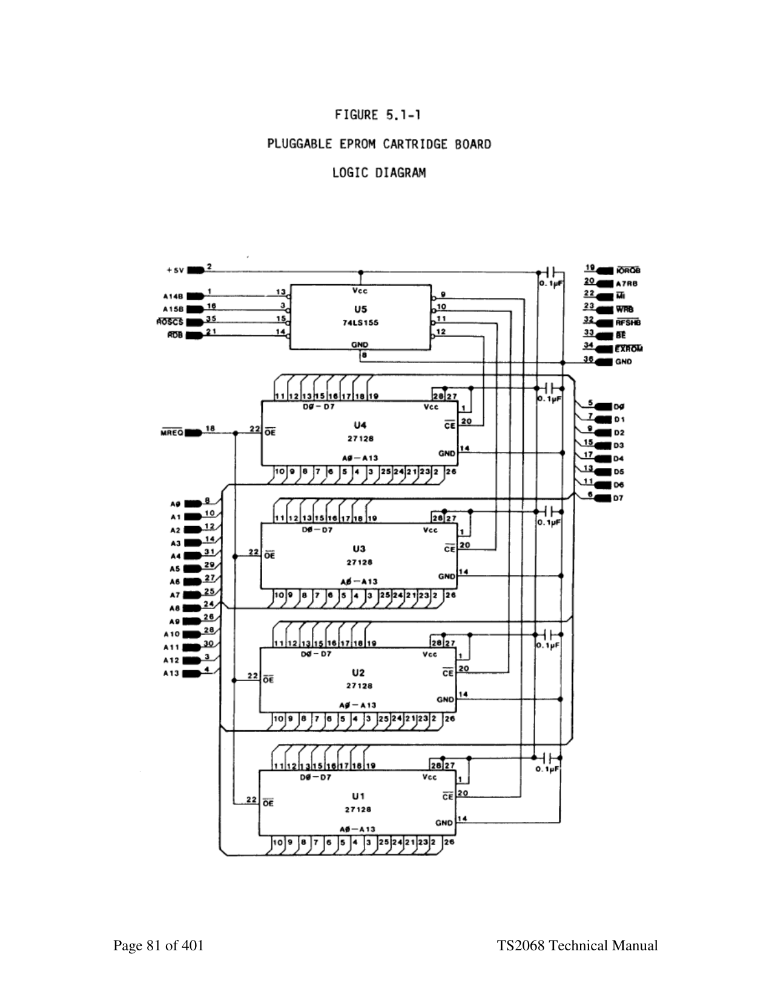

<!--
  DERIVED FILE — do not treat as authoritative.

  Source: docs/Timex Sinclair 2068 Technical Manual (best).pdf, pages 75-89
  Extracted mechanically with `pdftotext -layout`; tables in this chapter were
  then transcribed by hand and checked against the rendered page.

  The PDF itself is a 2016 Microsoft Word reconstruction of the 1986 Second
  Edition, and its own preface warns that the cut-and-paste used to make it
  "would sometimes mix text up in a way that word groups from a particular
  sentence would be transposed to different locations". That corruption is in
  the PDF, not in this extraction — see for example the bullet list on page 6.
  <!-- PDF page N --> markers below give the source page for every passage, so
  anything surprising can be checked against the original.
-->

# 5. Advanced Concepts

*Timex Sinclair 2068 Technical Reference Manual — pages 75-89.*
*[Full PDF](../Timex%20Sinclair%202068%20Technical%20Manual%20%28best%29.pdf) · [chapter index](README.md)*

---

<!-- PDF page 75 -->

"raspberry" which can be varied by modifying the values in the system variables PIP
(23609/5C39H) and RASP (23608 5C38H).

### 4.5 Sound Chip

The SOUND command writes the first parameter (register number) to Port 0F5H (address
to Programmable Sound Generator) and the second parameter (load data) to Port 0F6H
(data to PSG). The program line is scanned for multiple parameter pairs and
continues writing address/data pairs to the PSG until the end of the statement is reached.
See Section 2.1.6 for details on the hardware of the PSG.

## 5 Advanced Concepts

### 5.1 Cartridge Software/Hardware

#### 5.1.1 LROS

An LROS is identified by the following overhead bytes:

Location       Description
## 0000 Not Used

## 0001 Cartridge Type

0l=LROS
0002/0003      Starting Address (LSB/MSB)
Address to be jumped to after Operating System initialization is
complete. Order of bytes is as for a JP instruction.
## 0004 Memory Chunk Specification.

Bits 0-7 represent Chunks 0-7 respectively in the Dock Bank in
low active format:
0 if in use
1 if not in use
NOTE:           When writing to the Horizontal Select Register (Port F4H),
the Chunk Specification is High Active

The Memory Chunk Specification is used to enable the specified chunks in the Dock
Bank prior to jumping to the address specified in Location 2 and 3. Control is transferred
from the Initialization code in the Extension ROM via the GOTO BANK routine in
Home Bank RAM Chunk 3, therefore Bit 3 of the Memory Chunk Specification must be
set to 1 in order for the transfer to be accomplished as designed (Chunk 3 also contains
the Machine Stack).
CAUTION: If Chunk 3 is marked for' use in the Dock Bank, then when the
Memory Chunk Spec. is written to Port F4H by the Sank Enable
code, execution will continue from that point in Chunk 3 in the
Dock Bank with the Stack Pointer addressing ROM.

<!-- PDF page 76 -->

An LROS is Z80 machine code and is in complete control of the TS 2068 hardware after
transfer to the starting address has been made. It can directly implement an application, or
it can support multiple applications by implementing a language other than BASIC. An
AROS dependent on such an LROS would have to be part of the same cartridge since
there is only one cartridge connector.

Interruption Mode 1 has been set hy the TS 2068 and interruptions are enabled prior to
passing control to the LROS starting address, therefore the LROS must contain
appropriate code at location 56 (38H) to cover the case where the interruption occurs
after Chunk 0 in the Dock Bank has been enabled, hut before any action by the software
cartridge to disable the interruption has been taken. Once control is transferred, the LROS
may then disable the standard TS 2068 interruption by setting hit 6 of Port FFH, mask the
interruption by executing a DI instruction, or set a different Interruption Mode. It may
change the location of the Machine Stack. It may also change the memory selection by
writing to Port OF4H with each bit set to 1 for the corresponding chunk to he enabled in
the Dock Bank (high active format) or 0 to he enabled in the Home Bank. Thus, an
LROS may contain code in Chunk 3, hut it should be enabled after the OS RAM code has
finished execution.

Now that your LROS is in the driver's seat, you are on your own! Some important points
to remember when,, mapping your Dock Bank memory and doing bank switching are:

1.     The Display RAM is in Home Bank Chunk.2 for the primary display file and
Chunk 3 for the second display file. This memory is accessed independently by
the video hardware. The software only needs to enable it when actually reading or
writing it.

2.     The Dock Bank and Extension ROM Bank are mutually exclusive since they
share the Horizontal Select Register in Port F4H. You will need a routine in the
Home Bank RAM to do any switching between the two. You must also be careful
to have the appropriate Home Bank Chunks enabled which are referenced by the
Extension ROM code, e.g. the System Variables in Chunk 2 or possibly the bank
switching code in Chunk 3.

3.     Some interesting switching routines can be constructed by having parallel code in
shadowing chunks of memory to take advantage of the "instant" switch in
execution from one hank to another when the memory selection is made. E.g., a
routine in the Dock Bank ROM in Chunk 6 could push a Home Bank address on
the stack, write to Port F4H enabling Chunk 6 and any other desired chunks in the
Home Bank (by deselecting them in the Dock), and have code at the next
sequential instruction address in Home Bank RAM Chunk 6 to continue the path.
A Return instruction, for example, would pass control to the address on the stack.
Code to switch memory back to the Dock Bank could be mapped in a similar way.

4.     If you plan to use any of the System software routines, unless you know otherwise
it is probably necessary to maintain the contents of Home Bank Chunks 2 and 3

<!-- PDF page 77 -->

intact (and Chunk 7 if the OS RAM routines have been relocated). The system
routines rely heavily on the System Variables and assume that any pointers in
them are pointing to the Home Bank. See Section 3.3.4.1 for details on using the
RAM Interruption Handler and Section 6.0 for known corrections when using
System S/W.

5.      If you design an LROS implementing a higher-level language and want to support
an AROS application, you must design your own initialization code to detect the
presence of such an AROS. The TS 2068 will not look for the presence of an
AROS if an LROS is present, therefore there will be no entry for the AROS in the
System Configuration Table. Note that since there is only one cartridge connector,
such an AROS would also have to be integrated with the supporting LROS in a
single cartridge or cartridge board.

#### 5.1.2 AROS

An AROS is identified by the following overhead bytes

```text
Location              Description
32768                 Language Type
(8000H)                      1 = BASIC [and machine code]
                             2 = Machine code only
                             (Any other value will result in Error S, Missing LROS)
```

```text
32769                 Cartridge Type
(8001H)                       2 = AROS
```

```text
32770/32771           Starting Address(LSB/MSB)
(8002/8003H)                  BASIC AROS = Address of First Program Line
                              Machine Code AROS = Address of First Z80 Instruction
```

## 32772 Memory Chunk Specification

(8004H)                    Bits 0-7 represent Chunks 0-7 respectively in the Dock
Bank in low active format as follows:
0 if in use
1 if not in use
NOTE: Bits 0-3 must he set to 1 for proper
execution.

```text
32773                 Autostart Specification
(8005H)                      0 = No Autostart
                             1 = Autostart
```

<!-- PDF page 78 -->

32774/32775 Number of bytes of RAM to be
(8006/8007H) Reserved for Machine Code
Variables (LSB/MSB - OlOOH=l byte
Reserved; 0002H=512
bytes Reserved.

##### 5.1.2.1 BASIC AROS

A BASIC AROS is supported by special code in the System ROM (Section 3.2.1.2). The
portion of the cartridge containing BASIC program lines is restricted to the upper half of
the memory space beginning at location 32776 (8008H) in the Dock Bank. Support for
User-Defined Functions, which requires searching forthe definition parameters within the
program, is not implemented. Also, because the support code interfaces directly to the
bank switching code in. Home RAM Chunk 3 (does not allow for it to be relocated to
Chunk 7), a BASIC AROS cannot utilize the advanced video modes and also execute
BASIC program statements. If the cartridge contained machine code supporting advanced
video modes, the TS 2068 would have to be returned to "Normal " video mode with the
RAM mapped accordingly (see Figure 1.1-3) if control were to be returned to the BASIC
Interpreter USR code.

Since execution of the cartridge BASIC program is done by copying program lines to a
buffer in the Home Bank RAM (ARSBUF), the most efficient cartridge execution is
obtained by making program lines as large as possible, i.e. making use of the multi-
statement feature of the TS 206868. The reverse is true concerning execution of READ
commands. An entire DATA statement is copied to the Home Rank RAM, but only the
current item is accessed. It therefore will be more efficient to not make DATA statements
excessively long. The BASIC program lines appear in the cartridge in exactly the same
format used in the RAM, i.e. Line Number (2 bytes), Length (2 bytes), Command Token,
etc. terminated by an Enter (0DH). Numerical constants appearing in a program line are
followed by the CHR$(0EH) byte and 5-byt e floating point format described in the User
Manual (see Appendix C of the TS 2068 User Manual). The Variables area is built in the
RAM (address in VARS) exactly as though the program were in the RAM. All variables,
including arrays, are built at the time of program execution - there is no provision for
copying or accessing ore-defined: variables from the cartridge, however, see Section
5.3.2. The last program line must be followed by a terminator byte having the Most
Significant Bit set (e.g. 80H), otherwise the Interpreter cannot detect the end of the
program.

A BASIC AROS may contain machine code accessed via the USR function. If the
machine code address is within the memory designated by the AROS Memory Select
Specification as 'in use', the Dock Bank will be enabled, otherwise the machine code
address is assumed to be in the Home Bank. (See Section 6.0 for details on known
problems in this area of the code.) Obviously, once control is transferred to the machine
code in the AROS, the ball is now in your court. You could have additional machine code
residing in the lower half of the Dock Bank memory space which you can now switch in.

<!-- PDF page 79 -->

You only have to know what you're about. If and when you are ready to go back to
executing your BASIC program, you must enable Chunks O-3 in the Home Bank and
have the stack and other Home Bank RAM in the proper state for return to the USR
function code in the BASIC Interpreter, i.e. what it was when the USR function passed
control to you.

The Autostart feature begins execution out of the BASIC AROS immediately after
system initialization. If the Autostart parameter is zero, control will go to the BASIC
Interpreter as if there were no cartridge installed, although internal flags have been set
noting that a BASIC AROS is present. The cartridge will be started when you execute a
RUN or GOT0 Line Number command.

The final parameter in the overhead bytes allows you to reserve RAM beginning in
Chunk 3 at Location 26688 (6840H) for machine code and/or machine code variables.
The designated number of bytes are reserved by the AROS support code prior to
beginning program execution. The AROS buffer (ARSBUF) begins immediately
following this reserved area (see Fig. 1.1-3). Note that this area is part of the RAM that
gets relocated if the second display file is opened. Therefore access to your machine code
and/or variables should he conditional on the video mode rather than direct if you are
going to be using the advanced video modes,. This reserved area begins at 31488
(7B00H) when the second display file is open. Remember -- use of the second display file
and execution of BASIC program from the cartridge are mutually exclusive.

The standard technique of reserving space for machine code by modifying RAMTOP
could also be used to place machine code/variables at the top of the Home Bank RAM. If
you place code above (RAMTOP) which is to be accessed via the BASIC USR function,
the affected memory chunk(s) cannot be marked as "in use" in the cartridge in the AROS
Memory Selection Specification.

##### 5.1.2.2 Machine Code AROS

A machine code AROS is similar to an LROS with the exception that it is dependent on
the System ROM for interruption handling if the interruption is enabled. This implies that
Chunks O-3 are enabled in the Home Bank.

The Autostart parameter should be set to 1 since if it is zero, control will be passed to the
BASIC Interpreter as if the cartridge were not present. There is no BASIC command to
directly start execution of a Machine Code AROS.

Because of a "bug" in the Initialization code handling a Machine Code AROS, the
parameter specifying the number of bytes to be reserved for machine code variables must
be adjusted by adding 21 (15H) to the actual number of bytes needed. This preserves the
21 byte CHANS area starting at 26688 (6840H). The reserved area then starts at 26709
(6855H) (or 31488 (7B15H) when the second display file is open). Access to the
variables should be conditional based on the video mode rather than direct if you plan to

<!-- PDF page 80 -->

use the advanced video modes. If you do not plan to utilize any of the system software,
you can disregard the above and "do your own thing" with the RAM.

See Section 6.0 for known corrections when using System S/W.

#### 5.1.3 EPROM Cartridge Board Application

Figure 5.1-l provides the logic diagram for a pluggable EPROM cartridge board capable of
configuring up to four 16K-byte (128K-bit) EPROM's of the 27128 type. The artwork for the PC
board implementing that logic diagram is provided in Figures 5.1-2, 5.1-3 and 5.1-4 for the
Component Side art, the Solder Side art, and the Solder Mask (one common mask for both
sides), respectively.

See Section 2.4.2 for mechanical details of the connector portion of the PCB.

<!-- PDF page 81 -->



*Figure 5.1-1 — pluggable EPROM cartridge board logic diagram. Rendered from page 81 of the PDF: these drawings are vector art from the original Word document and carry no extractable text.*

<!-- PDF page 82 -->

### 5.2 Advanced Video Modes

The following sections describe the various video modes available on the TS 2068 and
the major software support functions necessary. See Sections 3.2.2.3 and 3.2.2.4 for
details on using the Video Mode Change Service. Appendix C contains descriptions and
code listings for a number of software packages developed by Timex that support various
screen modes and applications. Reference to these packages should aid in gaining an
understanding of the software techniques needed to support the video mode hardware.
The TS 2068 video mode hardware works out of two areas of RAM, the primary display
file at 4000H and the second display file at 6000H. Each area consists of 5912 (1B00H)
bytes used for pixel and/or attribute data based on the mode selected via bits 0-5 of Port
FFH. The pixel data area divides into three blocks, each supporting 8 contiguous lines on
the screen. See Section 2.1.10 for details on organization of the display RAM. Because
the two display files occupy the same relative positions within their respective 8K
Chunks, by setting/clearing Address Bit 13 a software routine can address the
corresponding location in each file:

```text
                                     Address: DF1
15 14 13 12 11 10                  9  8     7    6         5     4     3     2     1     0
0   1     0   X     X     X        X  X     X    X         X     X     X     X     X     X
4000H - 5AFFH (Bit 13 = 0)
```

```text
                                       Address: DF2
15 14 13 12 11 10                  9    8     7    6       5     4     3     2     1     0
0   1     1   X     X     X        X    X     X    X       X     X     X     X     X     X
6000H - 7AFFH (Bit 13 = 1)
```

In order to display a character on the screen, 8 bytes of pixel data must be entered into the
display file, one for each scan row. For a particular character position, the scan rows are
1OOH bytes apart. E.g, the 8 bytes of pixel data for position Line O/Column 0 are
located at 4000H, 4100H, 4200H ,......,4700H. Since this is the first character position on
the screen, its Attribute byte, in Normal Mode, is the first byte in the Attribute File which
starts at 5800H. The 768 (300H) Attribute Bytes are in sequential order starting at
position 0/0 through 0/31,1/0 through l/31, and so forth, ending with 23/0 through 23/31.

One method of determining the starting display file address for a particular line/column
position is to build a table containing the starting address of each of the 24 lines (2 bytes
per entry). Then construct an algorithm that takes the line number and forms an index by
multiplying it by 2 (shift left 1), add the index to the base address of the table, and read
out the display file address. The column position is then simply an offset added to this
address. By testing VIDMOD (23746 - 5CC2H) you can determine whether to set Bit
13 for the second display file, e.g. because you are in an odd column in 64-column mode,
or simply because you are using the second display file in dual screen mode.

<!-- PDF page 83 -->

The following example illustrates this method. The table entries are in Hex:

```text
Line #         Index          Table                  Comment
                              LSB/MSB
0              0              00 40 (4000H)          Line 0 (top of screen)
1              2              20 43                  Line 1
2              4              40 40                  Line 2
***                           (+20H)
7              14 (0EH)       E0 40                  Line 7 (end of upper block)
8              16 (10H)       00 48 (4800H)          Line 8 (top of middle block)
9              18 (12H)       20 48                  Line 9
***                           (+20H)
15             30 (1EH)       E0 48                  Line 15 (end of middle block)
16             32 (20H)       00 50 (5000H)          Line 16 (top of bottom block)
17             34 (22H)       20 50
***                           (+20H)
23             46 (2EH)       E0 50                  Line 23 (end of bottom block)
```

Line 17, Column 23 (11H/17H) would yield a display file address of 5020H + 17H =
5037H. If VIDMOD indicated the second display file was to be used, setting Bit 13 of the
address would yield 7037H. If we were using 64-column mode, because the column is
odd (Bit 0 = l) we would set Bit 13 of the starting line address getting 7020H, then divide
the column address by 2 (shift right 1) since there are only 32 columns in each display
file. This would give us an offset of 11 (0BH) which added to the starting address results
in a display file address of 702BH. Having the display file address, we now insert the 8
bytes of pixel data for the character desired, incrementing the display file address by
100H between each write (this is easily done by simply incrementing the upper register of
the register pair containing the address). The following routine is a simplified version
illustrating this process. It assumes that Reg. Pair DE contains the address of the desired
character in the character table and that HL contains the address of the desired position in
the display file.

```text
     LD        B, 8
LOOP LD        A, (DE)
     LD        (HL), A
     INC       DE
     INC       H
     DJNZ      LOOP
```

Finally, we must update the Attribute Byte controlling the updated character position.
The following sample algorithm will formulate the Attribute File address given the
address of any of the scan rows of the character position. We will assume we have saved
off the starting display file address and now have it in Register Pair HL.

<!-- PDF page 84 -->

```text
GETATT         LD A,H          ; MSB of DF Address
               RRCA            ; Shift right circular
               RRCA            ; to get Bits 3 & 4 (Block #)
               RRCA            ; to positions 0 & 1
               AND 3           ; Clear other bits
               OR 58H          ; OR in Attribute file base address
               LD H,A          ; Update MSB
```

NOTE: The LSB is the same as for the pixel data.

Using our first example, with a Display File address of 5037H, the Attribute File address
would be 5A37H. The second example was using 64-Column Mode which does not
require attribute file update (attributes determined by video mode setting).

See Section 5.2.2 for a sample algorithm to formulate the display file address for X,Y
pixel coordinates. The above routine for calculating Attribute File address would be
substituted for the method used in the example if not working in High Resolution
Graphics mode.

In addition to data insertion, two major screen support functions are scrolling and
clearing the screen. Scrolling is done in the System ROM by copying the entire display
file data and attribute controls up one line position (Line 1 to Line 0, Line 2 to Line 1,
etc.) and inserting a blank line at the bottom. Numerous more elaborate scrolling
techniques can be implemented using various directions (up, down, left, right) and
smaller areas or "windows" of the screen. Similarly, clearing the screen, which consists
of writing zeros to the data file and updating the attribute bytes to a uniform value, can be
implemented on smaller sections of the screen. The software packages in Appendix C
contain examples of such implementations.

#### 5.2.1 Dual Screen Mode

In this mode the second display file is used to provide a second independent screen
having the same data and attribute organization as the primary display file. By writing to
Port FFH with Bits 0-5 = 1 (Bit 0 set), the second display file is activated at the video
screen. Appendix C contains a software package supporting Dual Screen Mode., The
software package uses the system variable VIDMOD to determine which display file is
the target of the current operation. Special values for VIDMOD have been defined to
permit building of one display file while the other is active at the screen so that a
complete screen image is ready when the hardware mode is changed. Copy and Exchange
routines have been provided to move data within and between the two display files. This
enables the BASIC graphics commands like PLOT, CIRCLE and DRAW, which work
only in the primary display file, to be used to create screens which are then moved into
the second display file.

<!-- PDF page 85 -->

Because the System ROM works only in the primary display file, you can come up with
some unusual situations when you have the second display file active at the screen and
you are executing BASIC or using the System ROM routines. If an error occurs, for
example, the error message will be placed into the primary display file and the ROM will
be waiting for input from the keyboard to direct the next action, but all of this is invisible
since you have the other display file active. The machine will appear to be "hung", but it
is only doing its normal thing. Be prepared to enter a OUT 255,0 to an invisible
command line in order to switch the display back to the standard file!!! Don't forget to
also set VIDMOD (POKE 23746,128) to keep things consistent inside the dual
screen support code.

#### 5.2.2 High Resolution Graphics Mode

This mode is set by writing to Port OFFH with Bits 0-5=2 (Bit 1 set). In this mode, also
called Extended Color Mode, the second display file is used to expand the number of
Attribute bytes from one for each 8 X 8 pixel group to one for each 8 X 1 pixel group
thus giving 32 X 192 positions within each of which two colors plus Bright and Flash can
be defined. Each byte of pixel data entered into the primary display file has its own
Attribute byte in the corresponding location in the second display file, e.g. the byte
written to Location 4000H has its Attribute byte at Location 6000H, the byte at 47FFH
(last byte of last scan row in Line 7) has its Attribute byte at Location 67FFH, the byte at
57FFH (last byte of last scan row in Line 23) has its Attribute byte at Location 77FFH.
The routine writing data to the screen would therefore enter the pixel data to the desired
location and then set Address Bit 13 of the Primary Display File address and write the
desired attribute control byte to the resultant location. If normal characters are being
written to the screen in this mode, eight Attribute bytes must also be written, one for
each of the bytes defining the character. The same technique would be used for writing to
both display files, i.e. for each of the seven bytes entered after the first, the display
file address would be incremented by 256 (100H).

The System ROM graphics commands (PLOT, DRAW and CIRCLE) place data into the
Primary Display File and update the Attribute File associated with the standard video
mode (5800H-5AFFH). In High Resolution Graphics Mode, the hardware does not access
this area for attribute control, therefore its contents have no visible effect. If before or
immediately following execution of the BASIC graphics operation, you update the
attribute control information in the second display file, you could possibly take advantage
of the System ROM graphics capability. Admittedly, this is not a simple operation in the
case of circles or drawing diagonal lines and it will be more efficient to develop code
specifically to support this video mode.

The following sample routine takes as input two single byte binary digits representing the
X and Y coordinates of a pixel position on the screen. It formulates the display file
address of the byte containing the pixel, creates a pattern or mask byte for the specified
bit position, sets the bit in the display file, and updates the attribute byte (High Resolution
Graphics Mode assumed). This represents a simplified version of the approach used in
the System ROM graphics support routines PLOTBC and SCRMBL.

<!-- PDF page 86 -->

```text
The two inputs are assumed to be as follows:
Reg. C =      X Coordinate 0-255 (0-FFH) going left to right across the screen.
Reg. B =      Y Coordinate 0-191 (0-BFH) going from bottom to top of the screen.
```

NOTE:          This covers the full vertical range of 192 positions.

The Y Coordinate is checked for valid range and reversed directionally so that 0
represents the top of the screen and 191 represents the bottom. After this reversal, the two
coordinates represent the following values:

```text
                                          X
7         6            5         4           3             2        1           0
Screen Block           Line number within block            Scan Row within line
(0 - 2)                (0 - 7)                             (0 - 7)
```

```text
                                             Y
7         6            5           4             3         2           1          0
Column (0 - 31)                                            Bit (0 - 7)
```

We first formulate the MSB of the display file address using the Block and Scan Line
information in the Y Coordinate:

```text
PLOTXY         PUSH    BC
               LD      (SAVECO), BC           ; save coordinates
               LD      A, 191                 ; test Y within range
               SUB     B
               JP      C, ERROR               ; Y out of range
               LD      B, A                   ; Y coordinate not 0 = top
               AND     0C0H                   ; get block number
               RRA
               RRA
               RRA
               LD      H, A                   ; save block bits
               LD      A, B                   ; Y coordinate
               AND     07                     ; Get scan row bits
               OR      H                      ; combine block and scan row
               OR      40H                    ; base address of DF (4000H)
               LD      H, A                   ; H = MSB of DF address
```

<!-- PDF page 87 -->

Next we formulate the LSB of the display file address using the Line information from
the Y Coordinate and the Column information from the X Coordinate:

```text
LD   A, C               ; get X coordinate
RLCA                    ; align to pick up line
RLCA                    ; bits from Y
RLCA                    ; A= 2 LS bits column/XXX/3 MS
                        ; bits column
AND     0C7H            ; clear bits 3-5
LD      L, A            ; save A for later
LD      A, B            ; get Y coordinate
AND     38H             ; get line bits
OR      L               ; combine with column bits
RLCA                    ; shift to final position
RLCA                    ; A = line #/column
LD      L, A            ; L = LSB display file address
```

Next we get the pixel position within the byte by taking the last 3 bits of the X
Coordinate and create a mask byte having all bits zero except the addressed pixel. This
mask is then used to set the bit in the Display File. The address is set to Display File 2 to
update the Attribute File (High Res. Graphics Mode is assumed to be active), and the
routine is finished. The memory locations defined as ATTR and SAVECO are for
illustration purposes only:

```text
       LD      A, C                    ; get pixel position
       AND     7                       ; 0 = leftmost (MSB)
                                       ; 7 - rightmost (LSB)
     LD        B, A                    ; use as control count
     INC       B                       ; B = 1-8
     LD        A, 00000001B            ; bit mask
LOOP RRCA                              ; rotate mask bit
     DJNZ      LOOP                    ; to proper position
     OR        (HL)                    ; OR bit into DF
     LD        A, 20H
     OR        H                       ; set bit 13 for DF2
     LD        H, A                    ; HL = attribute file
     LD        A, (ATTR)               ; get attribute byte
     LD        (HL), A                 ; update attribute file
     POP       BC                      ; original X/Y to BC regs
     RET
```

Repetitive calls to this routine with the appropriate X/Y Coordinate values will "draw" on
the screen. The System ROM routines for drawing lines and circles calculate the

<!-- PDF page 88 -->

successive X/Y Coordinate values and use common low-level routines similar to the
above to place each pixel in the display file.

#### 5.2.3 64 Column Mode

In this mode, set by writing to Port 0FFH with Bits 0-2=6 (Bits 1 and 2 set) and Bits 3-5
selecting ink color (0-7), the pixel data portions of the two display files are merged by the
hardware on an alternating column basis to produce 64-columns across the screen. All
even columns (0,2,4....62) are derived from the primary display file and all odd columns
(1,3,5..... 63) are derived from the second display file. There are still 24 lines vertically
from top to bottom. The attributes are controlled by bits 3-5 written to Port FFH selecting
one of eight ink/paper combinations. The Bright and Flash attributes are fixed at 0 and
the Border is fixed to match the paper color. The Attribute Files in RAM at 5800H-
5AFFH (primary display file) and 7800H-7AFFH (second display file) are not utilized in
this mode.

Software supporting this mode must set up the display file address for character insertion
based on the column position (even=DFl; odd=DF2). When scrolling the screen (or a
portion of it), any line of text on the screen requires the same operation to be done at the
corresponding locations in each display file. This is also true to clear the screen (or a
portion of it). To save a Screen on tape you must save two Code files, one for each
display file. The SAVE filename SCREEN$ will work for the Primary Display File only.
You will have to specifically SAVE the second display file via a SAVE filename CODE
24576,6144. Note also that because the Border color is fixed by the video mode, you will
not see the usual "stripes" during a tape operation.

Code to support an 80-column mode screen was developed utilizing the 64-column
hardware mode and redefining the character size to a 6 X 8 pixel group (there is really
room for 84 characters if the full 256 pixel width is used). Since individual characters
now can span the two display files (e.g. 2 pixels in DFl and 4 in DF2) insertion of data
into the display files involves masking the 6-bit character (or portion thereof) with the 8
bits of data read/written from/to the display file.

Appendix C contains descriptions and code listings of software packages supporting 64
and 80-Column modes.

<!-- PDF page 89 -->

#### 5.2.4 Other

Appendix C also contains software packages supporting the following video screen
features:
A.      40-Column Mode - utilizes the 6 X 8 character set defined for 80-Column Mode
in "normal" mode. May be combined with the Dual Screen package.

B.     Sprites - supports movement of software-defined objects and multi-directional
screen scrolling services in the Primary Display File. You must create the actual
bit map defining the shape of your sprite(s), but this package does the rest.

### 5.3 Other Advanced Concepts

#### 5.3.1 Interruption Fielding

For a machine code program executing in the Home RAM, you can intercept the 17 ms.
interruption for your own purposes by permanently enabling Chunk 0 in the Extension
ROM Bank (write a 1 to Port OF4H and always have Bit 7 of Port OFFH = 1) and
inserting at Location 25262 (62AE Hex) a branch to your own interruption handler. (Or if
VIDMOD is not zero, insert your branch instruction at Location 64110 (FA6EH).) By
doing this you are forcing the interruption to branch to the RAM and then bypassing the
OS RAM Interruption Handler - see Sections 3 . 77 . 33 .1 and 3.3.3.1. Because the Video
Mode Change Service automatically updates internal branch addresses in the OS RAM
code when it is relocated between Chunk 3 and Chunk 7, you probably do not want to
directly overlay the OS RAM Interruption Handler with your own code if you will be
using the Video Mode service. Your branch instruction at 62AEH, however, will be
copied unmodified to location FA6EH in Chunk 7 and vice versa.

Note that this technique cannot be used if you are using BASIC since then you must have
Chunk 0 enabled in the Home Bank. It also cannot be used from a cartridge because the
memory selection hardware (Port 0F4H) is common to the Dock and Extension ROM
Banks and can only enable one of them at a given time as selected by Bit 7 of Port 0FFH.

#### 5.3.2 BASIC AROS Variables

In order to use pre-defined arrays and/or other BASIC variables, store them in the
cartridge (possibly in the lower half of the addressable space which is not usable for
BASIC program) and branch to a machine code routine via the USR function at the
beginning of your BASIC AROS program. Use this routine to do the necessary memory
selection and copy your data from the cartridge to the RAM (address in VARS). Adjust
the System Variables E LINE, WORKSP, STKBOT and STKEND to all point to the first
free memory following your BASIC variables. Of course, all BASIC variables must
conform to the format expected by the BASIC Interpreter. In addition to BASIC
structures, you can also store screen images and machine code/variables in the cartridge
for transfer to the RAM under your control. Consider using the XFER BYTES service in
the OS RAM.
